# Database Schema (Draft) — HRMS Trường Đại học Thủy Lợi

Tài liệu này đề xuất schema CSDL (mức logical + physical) dựa trên 2 tài liệu:
- Use case/UCS trong dự án
- STR/VIS (tính năng) và một số NFR (log/audit, multi-cơ sở)

Mặc định: PostgreSQL, dùng `uuid` cho PK; các trạng thái dùng `CHECK` để dễ đọc.

---

## 1) Tổng quan module & bảng

### A. Tài khoản, phân quyền, phiên làm việc
- `auth_users`: tài khoản đăng nhập (username/password hash, trạng thái active/locked)
- `auth_roles`: vai trò (Admin/TCCB/TCKT/Employee)
- `auth_user_roles`: gán vai trò cho user (nhiều-nhiều)
- (optional) `auth_permissions`, `auth_role_permissions`: nếu muốn “field-level security” chi tiết hơn mức role
- `session` (better-auth managed): phiên đăng nhập server-side, lưu trong DB, giao cookie HTTP-only. Áp dụng sliding expiration 30 phút (mỗi request reset timer; idle 30 phút → session bị hủy trong DB)
- `account` (better-auth managed): liên kết provider xác thực (credential, OAuth...)
- `verification` (better-auth managed): token xác minh email/điện thoại/reset mật khẩu
- `audit_logs`: log thao tác quan trọng (theo NFR “ghi nhật ký”)

### B. Cơ sở & cơ cấu tổ chức
- `campuses`: đa cơ sở (Hà Nội/Phố Hiến/TP.HCM)
- `org_units`: đơn vị tổ chức dạng cây (parent-child), mã đơn vị unique
- `org_unit_status_events`: lịch sử thành lập/sáp nhập/giải thể + quyết định + ngày hiệu lực

### C. Hồ sơ nhân sự (core)
- `employees`: hồ sơ nhân sự (mã cán bộ auto-gen, CCCD, liên hệ, trạng thái làm việc/hợp đồng, …)
- `employee_terminations`: sự kiện thôi việc (ngày, lý do)
- `employee_assignments`: lịch sử bổ nhiệm/bãi nhiệm vào đơn vị + chức vụ + ngày bắt đầu/kết thúc

### D. Thông tin chi tiết trong hồ sơ (sub-entities)
- `employee_family_members`: người thân/ phụ thuộc
- `employee_bank_accounts`: ngân hàng + số tài khoản (có thể để 1 bản ghi active)
- `employee_previous_jobs`: quá trình công tác trước khi về trường
- `employee_party_memberships`: thông tin Đảng/Đoàn
- `employee_degrees`: bằng cấp + file PDF
- `employee_certifications`: chứng chỉ + ngày cấp/hết hạn + file PDF
- `employee_foreign_work_permits`: phần mở rộng nếu là người nước ngoài (visa/hộ chiếu/giấy phép)

### E. Lương & phụ cấp (catalog + gán cho nhân sự)
- `salary_coefficients`: danh mục hệ số lương (ngạch + bậc + hệ số + trạng thái)
- `allowance_types`: danh mục loại phụ cấp (tên/mô tả/cách tính + trạng thái)
- `employee_allowances`: phụ cấp của nhân sự (liên kết loại phụ cấp + giá trị/ghi chú)

### F. Hợp đồng
- `contract_types`: loại hợp đồng (min/max tháng, max renewals, grace days, trạng thái)
- `employment_contracts`: hợp đồng của nhân sự (số HĐ, ngày ký, hiệu lực, hết hạn, đơn vị theo HĐ, nội dung, file PDF, trạng thái)
- `contract_appendices`: phụ lục hợp đồng (ngày hiệu lực, điều khoản bổ sung, …)

### G. Khen thưởng/Kỷ luật
- `employee_evaluations`: đánh giá (khen thưởng/kỷ luật) theo quyết định

### H. Đào tạo
- `training_course_types`: loại khóa đào tạo (theo cấu hình)
- `training_courses`: khóa đào tạo (thời gian, địa điểm, kinh phí, mở đăng ký, trạng thái)
- `training_registrations`: đăng ký khóa đào tạo (trạng thái tham gia)
- `training_results`: ghi nhận kết quả + chứng chỉ (PDF)

### I. Quản lý file
- `files`: metadata file upload (đường dẫn, mime, size, checksum). Các bảng khác lưu FK tới `files.id`.

---

## 2) ERD (Mermaid)

```mermaid
erDiagram
  auth_users ||--o{ auth_user_roles : has
  auth_roles ||--o{ auth_user_roles : has
  auth_users ||--o{ "session" : owns
  auth_users ||--o{ "account" : has
  auth_users ||--o{ audit_logs : writes

  campuses ||--o{ org_units : contains
  org_units ||--o{ org_units : parent
  org_units ||--o{ org_unit_status_events : events

  employees ||--o{ employee_family_members : has
  employees ||--o{ employee_bank_accounts : has
  employees ||--o{ employee_previous_jobs : has
  employees ||--o{ employee_party_memberships : has
  employees ||--o{ employee_degrees : has
  employees ||--o{ employee_certifications : has
  employees ||--o{ employee_foreign_work_permits : has
  employees ||--o{ employee_allowances : has
  employees ||--o{ employment_contracts : has
  employees ||--o{ employee_evaluations : has
  employees ||--o{ employee_assignments : has
  employees ||--o{ employee_terminations : has

  salary_coefficients ||--o{ employees : current_salary
  allowance_types ||--o{ employee_allowances : type

  contract_types ||--o{ employment_contracts : type
  employment_contracts ||--o{ contract_appendices : has

  training_course_types ||--o{ training_courses : type
  training_courses ||--o{ training_registrations : has
  employees ||--o{ training_registrations : registers
  training_registrations ||--o{ training_results : result

  files ||--o{ employees : portrait
  files ||--o{ employment_contracts : contract_pdf
  files ||--o{ employee_degrees : degree_pdf
  files ||--o{ employee_certifications : cert_pdf
  files ||--o{ training_results : certificate_pdf
```

---

## 3) Chi tiết bảng (tóm tắt cột chính)

### 3.1 `auth_users`
- `id` (uuid, PK)
- `username` (unique)
- `password_hash`
- `full_name`
- `email` (unique, nullable)
- `employee_id` (FK -> `employees.id`, nullable, unique) — ràng buộc “1 mã nhân sự chỉ có 1 tài khoản”
- `status` (`active` | `locked`)
- `created_at`, `updated_at`, `last_login_at`

### 3.2 `org_units`
- `id` (uuid)
- `campus_id` (FK)
- `parent_id` (FK self)
- `unit_code` (unique)
- `unit_name`
- `unit_type` (các loại: HĐ/Ban/Khoa/Phòng/Bộ môn/…)
- `is_leaf_confirmed` (boolean) — “xác nhận đơn vị nút”
- `status` (`active` | `merged` | `dissolved`)
- thông tin liên hệ (address, email, phone, website)

### 3.3 `employees`
- `id` (uuid)
- `staff_code` (unique) — mã cán bộ (tự sinh theo sequence)
- `full_name`, `dob`, `gender`
- `national_id` (CCCD, unique)
- `email`, `phone`, `address`, `hometown`
- `tax_code`, `social_insurance_no`, `health_insurance_no` (nullable)
- `is_foreigner` (bool)
- `work_status` (`pending` | `working` | `terminated`)
- `contract_status` (`none` | `valid` | `expired` | `renewal_wait`)
- `current_org_unit_id` (FK -> `org_units.id`, nullable)
- `current_position_title` (text, nullable) — có thể normalize thêm bảng `positions`
- `salary_coefficient_id` (FK -> `salary_coefficients.id`, nullable)
- `portrait_file_id` (FK -> `files.id`, nullable)

### 3.4 `employment_contracts`
- `id` (uuid)
- `employee_id` (FK)
- `contract_type_id` (FK)
- `contract_no` (unique per organization; có thể unique toàn hệ thống)
- `signed_at`, `effective_from`, `effective_to`
- `org_unit_id` (FK -> `org_units.id`) — “đơn vị công tác theo hợp đồng”
- `status` (`draft` | `valid` | `expired` | `terminated`)
- `content_html` (text)
- `contract_file_id` (FK -> `files.id`)

### 3.5 Đào tạo
- `training_courses`: gồm thông tin khóa học + cửa sổ đăng ký + giới hạn
- `training_registrations`: 1 nhân sự đăng ký 1 khóa; unique(employee_id, course_id)
- `training_results`: kết quả (completed/failed) + file chứng chỉ

---

## 4) Ghi chú thiết kế / nghiệp vụ mapping

- **Tự động khóa tài khoản khi nhân sự “đã thôi việc”**: DB hỗ trợ bằng `employees.work_status = 'terminated'` và một job/service cập nhật `auth_users.status = 'locked'`.
- **Không thể khóa tài khoản đang đăng nhập**: đây là logic ứng dụng; DB hỗ trợ nhờ `session` table (better-auth managed).
- **Phiên đăng nhập (Session)**:
  - **Không dùng JWT** — toàn bộ session được lưu server-side trong bảng `session` (PostgreSQL).
  - Client nhận cookie HTTP-only, Secure (`__session`) chứa session token.
  - **Sliding expiration 30 phút**: mỗi request hợp lệ cập nhật `expiresAt = now() + 30 phút`. Nếu user idle 30 phút, session hết hạn → bị xóa/coi là invalid → user phải đăng nhập lại.
  - Cấu hình better-auth: `session.expiresIn = 1800`, `session.updateAge = 0`.
- **Bậc lương unique trong cùng ngạch**: constraint unique(`grade_code`,`step_no`) trong `salary_coefficients`.
- **Không xóa danh mục đang được dùng**: FK + `ON DELETE RESTRICT` hoặc soft-delete (`is_active=false`).
- **Cơ cấu dạng cây**: dùng adjacency list (`parent_id`). Nếu cần query nhanh toàn cây, có thể bổ sung `ltree`/closure table sau.
- **Field-level security**: tối thiểu role-based (TCCB/TCKT/Employee). Nếu muốn “đến mức trường dữ liệu”, nên thêm `auth_permissions` (resource+field+action) và map cho role.

---

## 5) Next step

- Xem file DDL tương ứng: `database/schema.postgres.sql`

## 6) Assumptions & Questions (cần bạn xác nhận)

### Assumptions mình đang dùng
1. 1 nhân sự ↔ tối đa 1 tài khoản đăng nhập (ràng buộc `auth_users.employee_id UNIQUE`).
2. Nhân sự có thể có **nhiều** hợp đồng theo thời gian (lịch sử), và hệ thống suy ra `employees.contract_status` từ hợp đồng mới nhất.
3. Đơn vị tổ chức dùng mô hình cây `parent_id` (adjacency list) là đủ cho giai đoạn đầu.
4. File upload lưu theo `files.storage_path` (ứng dụng quản lý storage), DB chỉ lưu metadata.

### Questions
1. Bạn dự kiến dùng DBMS nào: PostgreSQL / MySQL / SQL Server? (DDL hiện tại là PostgreSQL)
2. Quy tắc sinh `staff_code` (Mã cán bộ) như thế nào? (ví dụ: `TLU-YYYY-xxxx` hay số tự tăng)
3. `contract_no` (Số HĐ) có unique toàn trường hay chỉ unique theo năm/đơn vị?
4. “Field-level security” bạn muốn thực thi tới mức nào?
  - Chỉ cần phân quyền theo role (TCCB/TCKT/Employee)
  - Hay cần cấu hình quyền theo từng trường (vd: lương/địa chỉ/SDT) trong DB/permission tables

