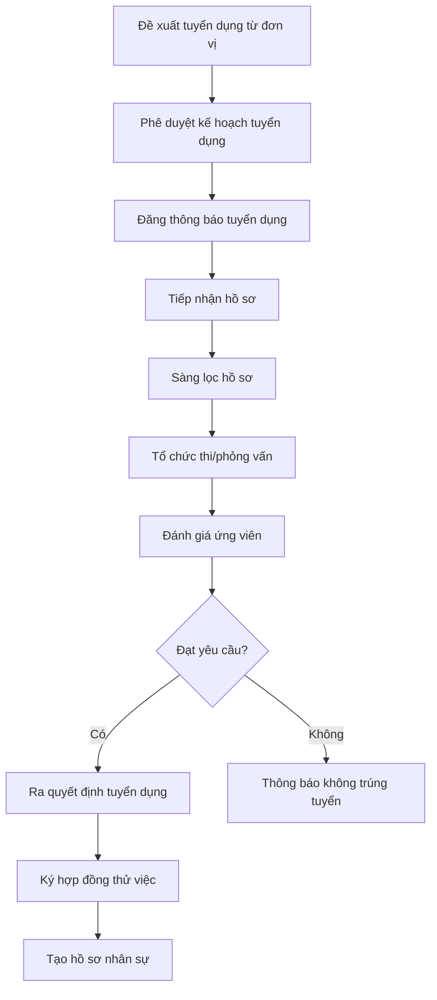
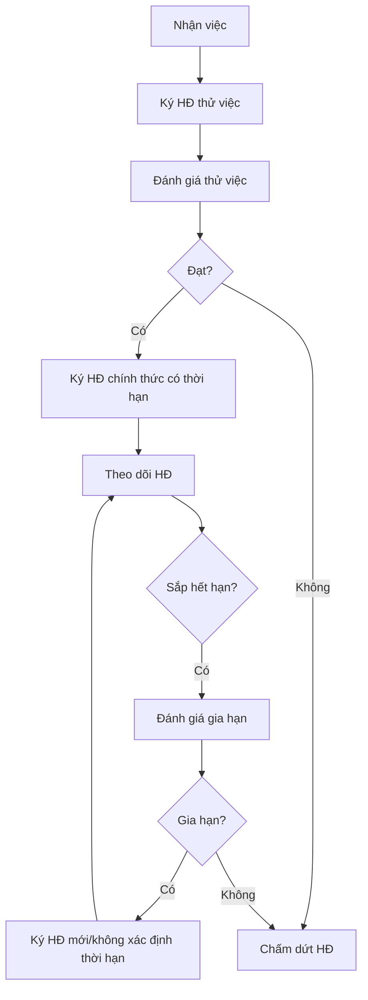
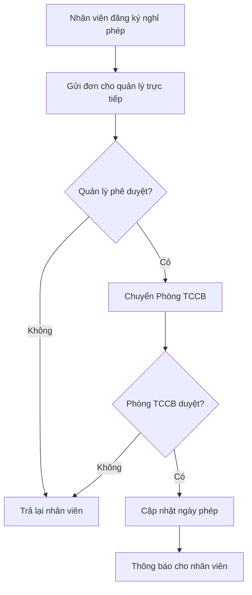
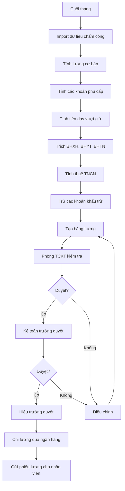
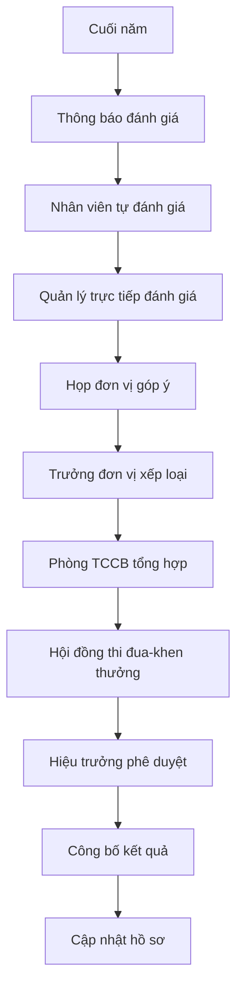

# Tài liệu Đặc tả Yêu cầu Người dùng

# Hệ thống Quản lý Nhân sự (HRMS) - Trường Đại học Thủy lợi

> **Phiên bản:** 1.0  
> **Ngày tạo:** 21/01/2026  
> **Dự án:** Phân tích và Thiết kế Phần mềm - Hệ thống Quản lý Nhân sự  
> **Đơn vị:** Trường Đại học Thủy lợi (TLU)

---

## Mục lục

1. [Giới thiệu](#1-giới-thiệu)
    - 1.1 [Mục đích tài liệu](#11-mục-đích-tài-liệu)
    - 1.2 [Giới thiệu về Trường Đại học Thủy lợi](#12-giới-thiệu-về-trường-đại-học-thủy-lợi)
2. [Bối cảnh và Phạm vi](#2-bối-cảnh-và-phạm-vi)
    - 2.1 [Cơ cấu tổ chức cần quản lý](#21-cơ-cấu-tổ-chức-cần-quản-lý)
    - 2.2 [Tài liệu tham chiếu từ TLU](#22-tài-liệu-tham-chiếu-từ-tlu)
    - 2.3 [Phạm vi hệ thống](#23-phạm-vi-hệ-thống)
    - 2.4 [Phân loại Quy tắc Nghiệp vụ](#24-phân-loại-quy-tắc-nghiệp-vụ-business-rules-classification)
3. [Các bên liên quan (Stakeholders)](#3-các-bên-liên-quan-stakeholders)
4. [Yêu cầu chức năng](#4-yêu-cầu-chức-năng)
    - 4.1 [Quản lý Hồ sơ Nhân sự (FR-ER)](#41-module-quản-lý-hồ-sơ-nhân-sự-employee-records-management)
    - 4.2 [Quản lý Trình độ và Chức danh (FR-QM)](#42-module-quản-lý-trình-độ-và-chức-danh-qualifications-management)
    - 4.3 [Quản lý Cơ cấu Tổ chức (FR-OS)](#43-module-quản-lý-cơ-cấu-tổ-chức-organization-structure-management)
    - 4.4 [Quản lý Hợp đồng Lao động (FR-CM)](#44-module-quản-lý-hợp-đồng-lao-động-contract-management)
    - 4.5 [Chấm công và Quản lý Nghỉ phép (FR-TA)](#45-module-chấm-công-và-quản-lý-nghỉ-phép-time--attendance)
    - 4.6 [Dữ liệu Lương (FR-SD)](#46-dữ-liệu-lương-và-phụ-cấp-salary-data-for-external-integration)
    - 4.7 [Tuyển dụng (FR-RC)](#47-module-tuyển-dụng-recruitment)
    - 4.8 [Đánh giá và Khen thưởng - Kỷ luật (FR-PR)](#48-module-đánh-giá-và-khen-thưởng---kỷ-luật-performance--rewards)
    - 4.9 [Đào tạo và Phát triển (FR-TD)](#49-module-đào-tạo-và-phát-triển-training--development)
    - 4.10 [Nghiên cứu Khoa học (FR-RM)](#410-module-nghiên-cứu-khoa-học-research-management)
    - 4.11 [Quản lý Giờ giảng (FR-TL)](#411-module-quản-lý-giờ-giảng-teaching-load-management)
    - 4.12 [Báo cáo và Thống kê (FR-RP)](#412-module-báo-cáo-và-thống-kê-reporting--analytics)
    - 4.13 [Self-Service Portal (FR-SS)](#413-module-self-service-portal-cổng-nhân-viên)
    - 4.14 [Quản lý Cấu hình Hệ thống (FR-CF)](#414-module-quản-lý-cấu-hình-hệ-thống-system-configuration-management)
5. [Yêu cầu phi chức năng](#5-yêu-cầu-phi-chức-năng)
6. [Mô hình nghiệp vụ](#6-mô-hình-nghiệp-vụ)
7. [Phụ lục](#7-phụ-lục)

---

## 1. Giới thiệu

### 1.1 Mục đích tài liệu

Tài liệu này mô tả chi tiết các yêu cầu người dùng cho Hệ thống Quản lý Nhân sự (Human Resource Management System - HRMS) được phát triển riêng cho Trường Đại học Thủy lợi. Tài liệu phục vụ làm cơ sở để:

- Phân tích và thiết kế hệ thống
- Xác định phạm vi và các tính năng cần phát triển
- Làm tài liệu tham chiếu cho việc kiểm thử và nghiệm thu

### 1.2 Giới thiệu về Trường Đại học Thủy lợi

**Trường Đại học Thủy lợi (Thuyloi University - TLU)** là cơ sở giáo dục đại học công lập trực thuộc Bộ Nông nghiệp và Môi trường với hơn **65 năm** lịch sử phát triển.

| Thông tin                | Chi tiết                                          |
| ------------------------ | ------------------------------------------------- |
| Thành lập                | 1959 (tiền thân: Học viện Thủy lợi Điện lực)      |
| Loại hình                | Đại học công lập                                  |
| Cơ quan chủ quản         | Bộ Nông nghiệp và Môi trường                      |
| Quy mô sinh viên         | 24,000+ người học                                 |
| Số CBGV                  | **1,203 người** (số liệu 2025)                    |
| Số ngành đào tạo         | 43 chương trình đại học, 17 thạc sĩ, 15 tiến sĩ   |
| Tỷ lệ giảng viên tiến sĩ | **61.3%** (một trong những tỷ lệ cao nhất VN)     |
| Đối tác                  | 500+ trong và ngoài nước                          |
| Cơ sở                    | Hà Nội (175 Tây Sơn), Phố Hiến (Hưng Yên), TP.HCM |

---

## 2. Bối cảnh và Phạm vi

### 2.1 Cơ cấu tổ chức cần quản lý

#### 2.1.1 Các đơn vị quản lý, phục vụ (Phòng/Ban)

| STT | Tên đơn vị                            | Mã đơn vị |
| --- | ------------------------------------- | --------- |
| 1   | Phòng Hành chính - Tổng hợp           | HCTH      |
| 2   | Phòng Tổ chức Cán bộ                  | TCCB      |
| 3   | Phòng Đào tạo                         | DT        |
| 4   | Phòng Khảo thí và Đảm bảo chất lượng  | KTDBCL    |
| 5   | Phòng Chính trị và Công tác sinh viên | CTCTSV    |
| 6   | Phòng Khoa học công nghệ              | KHCN      |
| 7   | Phòng Hợp tác quốc tế                 | HTQT      |
| 8   | Phòng Tài chính - Kế toán             | TCKT      |
| 9   | Phòng Quản trị - Thiết bị             | QTTB      |
| 10  | Thư viện                              | TV        |
| 11  | Trung tâm Nội trú                     | TTNT      |
| 12  | Trung tâm Tin học                     | TTTH      |
| 13  | Trạm Y tế                             | TYT       |

#### 2.1.2 Các đơn vị đào tạo (Khoa/Trung tâm)

| STT | Tên đơn vị                               | Mã đơn vị | Website              |
| --- | ---------------------------------------- | --------- | -------------------- |
| 1   | Khoa Công trình                          | KCT       | ce.tlu.edu.vn        |
| 2   | Khoa Kỹ thuật tài nguyên nước            | KKTTN     | kttnn.tlu.edu.vn     |
| 3   | Khoa Cơ khí                              | KCK       | khoacokhi.tlu.edu.vn |
| 4   | Khoa Điện - Điện tử                      | KDDT      | ee.tlu.edu.vn        |
| 5   | Khoa Kinh tế và Quản lý                  | KKTQL     | fem.tlu.edu.vn       |
| 6   | Khoa Kế toán và Kinh doanh               | KKTKD     | fab.tlu.edu.vn       |
| 7   | Khoa Công nghệ thông tin                 | KCNTT     | cse.tlu.edu.vn       |
| 8   | Khoa Hóa và Môi trường                   | KHMT      | env.tlu.edu.vn       |
| 9   | Khoa Luật và Lý luận Chính trị           | KLLCT     | pl.tlu.edu.vn        |
| 10  | Trung tâm Đào tạo quốc tế                | TTDTQT    | sie.tlu.edu.vn       |
| 11  | Trung tâm Giáo dục Quốc phòng và An ninh | TTGDQPAN  | ttgdqp.tlu.edu.vn    |
| 12  | Phân hiệu Đại học Thủy lợi (TP.HCM)      | PHDHTL    | tlus.edu.vn          |

##### Chi tiết Cơ cấu Bộ môn trong các Khoa

> [!NOTE]
> Thông tin chi tiết về cơ cấu bộ môn dưới đây được thu thập từ website các Khoa nhằm thiết kế chính xác cấu trúc phân cấp tổ chức trong hệ thống HRMS.

**1. Khoa Công nghệ thông tin (KCNTT)**

- Địa chỉ: Nhà C1, 175 Tây Sơn, Đống Đa, Hà Nội
- Email: vpkcntt@tlu.edu.vn
- Các bộ môn:
  | STT | Tên Bộ môn |
  | --- | ------------------------------- |
  | 1 | Bộ môn Công nghệ phần mềm |
  | 2 | Bộ môn Hệ thống thông tin |
  | 3 | Bộ môn Mạng và An toàn thông tin|
  | 4 | Bộ môn Tin học và Kỹ thuật tính toán |
  | 5 | Bộ môn Trí tuệ nhân tạo |
  | 6 | Bộ môn Toán học |
- Phòng thí nghiệm: Có các PTN phục vụ nghiên cứu và đào tạo

**2. Khoa Công trình (KCT) - Viện Kỹ thuật Công trình (VKTCT)**

- Đặc thù: Khoa Công trình hoạt động song song với Viện Kỹ thuật Công trình, có cùng Trưởng khoa kiêm Viện trưởng
- Chức năng: Đào tạo + Tư vấn thiết kế + Nghiên cứu khoa học
- Địa chỉ: Phòng 402, Tầng 4, nhà A1, 175 Tây Sơn, Kim Liên, Hà Nội
- Điện thoại: (024) 3852.2024
- Email: vpkct@tlu.edu.vn
- **Thống kê nhân sự:**
  | Chỉ tiêu | Số lượng |
  | ---------------------- | -------- |
  | Nhà giáo nhân dân | 05 |
  | Nhà giáo ưu tú | 30 |
  | Giáo sư | 07 |
  | Phó Giáo sư | 18 |
  | Tiến sĩ | 50 |
  | Thạc sĩ | 11 |
  | Giảng viên đang làm NCS| 41 |
- Các bộ môn (10 bộ môn):
  | STT | Tên Bộ môn |
  | --- | -------------------------------------- |
  | 1 | Bộ môn Thủy công |
  | 2 | Bộ môn Công nghệ và Quản lý xây dựng |
  | 3 | Bộ môn Kết cấu Công trình |
  | 4 | Bộ môn Sức bền - Kết cấu |
  | 5 | Bộ môn Địa kỹ thuật |
  | 6 | Bộ môn Vật liệu xây dựng |
  | 7 | Bộ môn Công trình giao thông |
  | 8 | Bộ môn Xây dựng dân dụng và Công nghiệp|
  | 9 | Bộ môn Thủy điện và Năng lượng tái tạo |
  | 10 | Bộ môn Công trình Biển và Đường thủy |
- Viện Kỹ thuật Công trình (song song với Khoa):
    - Đội ngũ: 100 người (06 PGS, 03 TS, 30 ThS) + 100 cộng tác viên
    - Gồm 09 trung tâm và 01 phòng
- Ghi chú HRMS: Cần hỗ trợ cấu trúc Khoa-Viện song song, một người có thể giữ 2 chức vụ

**3. Khoa Cơ khí (KCK)**

- Năm thành lập: 1986
- Địa chỉ: Phòng 312-314, nhà A1, 175 Tây Sơn, Đống Đa, Hà Nội
- Email: khoaM@tlu.edu.vn
- Điện thoại: (04) 3853.3082
- **Thống kê nhân sự mẫu:**
  | Chỉ tiêu | Số lượng |
  | ---------------------- | -------- |
  | Tổng cán bộ, giảng viên| 62 |
  | Giáo sư, Phó Giáo sư | 08 |
  | Tiến sĩ | 24 |
  | Nghiên cứu sinh | 11 |
  | Thạc sĩ | 18 |
  | Nhà giáo ưu tú | 06 |
- Ban chủ nhiệm khoa:
    - Trưởng Khoa: PGS.TS Đoàn Yên Thế
    - Phó trưởng khoa: TS. Nguyễn Ngọc Huyên
    - Phó trưởng khoa: PGS.TS Nguyễn Anh Tuấn
- Các bộ môn (6 bộ môn):
  | STT | Tên Bộ môn | Trưởng BM |
  | --- | ----------------------------- | --------------------------- |
  | 1 | Bộ môn Công nghệ cơ khí | TS. Phan Bình Nguyên |
  | 2 | Bộ môn Kỹ thuật hệ thống công nghiệp | PGS.TS Nguyễn Anh Tuấn |
  | 3 | Bộ môn Kỹ thuật ô tô | PGS.TS Nguyễn Đức Ngọc |
  | 4 | Bộ môn Kỹ thuật cơ điện tử | TS. Nguyễn Huy Thế |
  | 5 | Bộ môn Cơ học kỹ thuật | TS. Nguyễn Thị Thanh Bình |
  | 6 | Bộ môn Đồ họa kỹ thuật | ThS.Kts. Nguyễn Việt Anh |
- Phòng thí nghiệm (4 PTN):
    - PTN Kỹ thuật Hệ thống Công nghiệp
    - PTN Vật liệu kỹ thuật và Kỹ thuật đo
    - PTN Kỹ thuật ô tô
    - Phòng Thực hành Mô phỏng số và Robot
- Xưởng thực hành (2 xưởng):
    - Xưởng Cơ khí
    - Xưởng thực hành Kỹ thuật Ô tô
- Trung tâm: Trung tâm KHCN Cơ học và Máy Thủy lợi
- Ngành đào tạo: Kỹ thuật cơ khí, Công nghệ chế tạo máy, Kỹ thuật ô tô, Kỹ thuật cơ điện tử

**4. Khoa Điện - Điện tử (KDDT)**

- Website: ee.tlu.edu.vn
- Địa chỉ: Phòng 106-109, Nhà B5, 175 Tây Sơn, Đống Đa, Hà Nội
- Ban chủ nhiệm khoa:
    - Trưởng khoa: TS. Nguyễn Nhất Tùng
    - Phó trưởng khoa: TS. Nguyễn Quang Thuấn
    - Phó trưởng khoa: PGS.TS. Phạm Đức Đại
- Văn phòng khoa: ThS. Cao Thị Nụ, ThS. Nguyễn Thị Thúy An
- Các bộ môn (5 bộ môn):
  | STT | Tên Bộ môn | Trưởng BM |
  | --- | ----------------------------------------- | ------------------------ |
  | 1 | Bộ môn Vật lý | PGS.TS. Phan Văn Độ |
  | 2 | Bộ môn Kỹ thuật điện, điện tử | PGS.TS. Nguyễn Minh Ý |
  | 3 | Bộ môn Kỹ thuật điều khiển và Tự động hóa | PGS.TS. Phạm Đức Đại |
  | 4 | Bộ môn Điện tử viễn thông | TS. Trần Văn Hội |
  | 5 | Bộ môn Kỹ thuật Robot và Hệ thống thông minh | PGS.TS. Lê Trung Dũng |
- Trung tâm: Trung tâm Kỹ thuật Điện và Tự động hóa
- Phòng thí nghiệm (4 PTN):
    - PTN Vật lý (Nhà B5 - 175 Tây Sơn)
    - PTN Kỹ thuật điện (Hưng Yên và Hà Nội)
    - PTN Hệ thống nhúng, IoT và Điện tử viễn thông (109 Nhà B5)
    - PTN Kỹ thuật điều khiển và Tự động hóa (108 Nhà B5)
- Ngành đào tạo: Kỹ thuật điện, Kỹ thuật điện tử - viễn thông, Kỹ thuật điều khiển và tự động hóa, Kỹ thuật Robot

**5. Khoa Hóa và Môi trường (KHMT)**

- Địa chỉ: P316-317, nhà A5, 175 Tây Sơn, Đống Đa, Hà Nội
- Điện thoại: 024.3564.0704
- Ban chủ nhiệm khoa:
    - Phó Trưởng khoa (Phụ trách): PGS.TS Nguyễn Thị Lan Hương
    - Phó Trưởng khoa: TS Trịnh Đình Khá
- Sứ mệnh: Đào tạo nguồn nhân lực chất lượng cao trong lĩnh vực môi trường, công nghệ sinh học và kỹ thuật hóa học
- Các bộ môn:
  | STT | Tên Bộ môn | Địa chỉ văn phòng |
  | --- | ------------------------------- | ------------------ |
  | 1 | Bộ môn Kỹ thuật và Quản lý Môi trường | (thành lập 1993) |
  | 2 | Bộ môn Kỹ thuật Hóa học | P313 - Nhà A5 |
  | 3 | Bộ môn Công nghệ sinh học | (thành lập 11/2018)|

**6. Khoa Kỹ thuật tài nguyên nước (KKTTN)**

- Địa chỉ: Phòng 301-307 Nhà A1, 175 Tây Sơn, Kim Liên, Hà Nội
- Điện thoại: 0243.852.8026
- Email: khoaTNN@tlu.edu.vn
- Website: kttnn.tlu.edu.vn
- **Thống kê nhân sự:**
  | Chỉ tiêu | Số lượng |
  | ---------------------- | -------- |
  | Tổng cán bộ, giảng viên| 62 |
  | Giáo sư | 01 |
  | Phó Giáo sư | 17 |
  | Tiến sĩ | 33 |
  | Thạc sĩ | 10 |
  | Kỹ sư | 01 |
- Ban chủ nhiệm khoa:
    - Trưởng khoa (kiêm Viện trưởng Viện KTTNN): PGS.TS. Lê Văn Chín
    - Phó trưởng khoa (kiêm Viện trưởng Viện TV, MT & BĐKH): GS.TS. Phạm Thị Hương Lan
    - Phó trưởng khoa: PGS.TS. Đặng Minh Hải
    - Phó trưởng khoa (kiêm P. Viện trưởng Viện TV, MT & BĐKH): PGS.TS. Hoàng Thanh Tùng
- Các bộ môn (7 bộ môn):
  | STT | Tên Bộ môn | Trưởng BM |
  | --- | --------------------------------- | -------------------------- |
  | 1 | Bộ môn Kỹ thuật Tài nguyên nước | TS. Nguyễn Quang Phi |
  | 2 | Bộ môn Thủy lực | PGS.TS. Hồ Việt Hùng |
  | 3 | Bộ môn Cấp thoát nước | PGS.TS. Đoàn Thu Hà |
  | 4 | Bộ môn Kỹ thuật Hạ tầng | TS. Lưu Văn Quân |
  | 5 | Bộ môn Trắc địa | TS. Lã Phú Hiến |
  | 6 | Bộ môn Thủy văn và Biến đổi khí hậu | PGS.TS. Ngô Lê An |
  | 7 | Bộ môn Kỹ thuật sông và Quản lý thiên tai | GS.TS. Phạm Thị Hương Lan |
- Cơ cấu tổ chức: Có Ban lãnh đạo các thời kỳ được lưu trữ
- Đặc thù: Hoạt động song song với Viện Kỹ thuật Tài nguyên nước và Viện Thủy văn, Môi trường & BĐKH

**7. Khoa Kinh tế và Quản lý (KKTQL)**

- Năm thành lập: 1980 (45 năm lịch sử tính đến 2025)
- Website: fem.tlu.edu.vn
- Địa chỉ: Phòng 218-222, nhà A1, 175 Tây Sơn, Đống Đa, Hà Nội
- Hoạt động: Hội nghị viên chức, người lao động hàng năm; Nghiên cứu khoa học sinh viên; Công đoàn bộ phận
- Các bộ môn và trung tâm (8 đơn vị):
  | STT | Tên Bộ môn/Trung tâm |
  | --- | ---------------------------------- |
  | 1 | Bộ môn Kinh tế |
  | 2 | Bộ môn Kinh tế xây dựng |
  | 3 | Bộ môn Quản trị du lịch |
  | 4 | Bộ môn Thương mại điện tử |
  | 5 | Bộ môn Logistics và chuỗi cung ứng |
  | 6 | Bộ môn Kinh tế và Kinh doanh số |
  | 7 | Bộ môn Phát triển kỹ năng |
  | 8 | Trung tâm Kinh tế và Quản lý |
- Ngành đào tạo: Kinh tế, Kinh tế xây dựng, Quản trị kinh doanh, Quản trị du lịch, Thương mại điện tử, Logistics và chuỗi cung ứng

**8. Trung tâm Đào tạo quốc tế (TTDTQT)**

- Cơ cấu tổ chức:
  | STT | Đơn vị |
  | --- | ------------------------------- |
  | 1 | Ban Giám đốc |
  | 2 | Văn phòng Trung tâm |
  | 3 | Bộ môn Tiếng Anh |
  | 4 | Bộ môn Ngôn ngữ Anh |
  | 5 | Bộ môn Ngôn ngữ Trung Quốc |
- Đối tác quốc tế: Nhiều trường đại học quốc tế
- Chức năng: Đào tạo chương trình tiên tiến, liên kết quốc tế

**9. Trung tâm Giáo dục Quốc phòng và An ninh (TTGDQPAN)**

- Website: ttgdqp.tlu.edu.vn
- Chức năng: Đào tạo giáo dục quốc phòng an ninh cho sinh viên

> [!IMPORTANT]
> **Yêu cầu HRMS từ cơ cấu tổ chức:**
>
> - Hỗ trợ cấu trúc phân cấp: Trường → Khoa/Viện/Trung tâm → Bộ môn → Giảng viên
> - Quản lý chức vụ kiêm nhiệm (1 người có thể giữ nhiều chức vụ ở các đơn vị khác nhau)
> - Quản lý lịch sử lãnh đạo qua các thời kỳ
> - Quản lý phòng thí nghiệm gắn với đơn vị
> - Hỗ trợ các loại đơn vị: Khoa, Viện, Trung tâm, Bộ môn, Phòng thí nghiệm

#### 2.1.3 Các đơn vị KHCN kết hợp đào tạo (Viện/Trung tâm nghiên cứu)

| STT | Tên đơn vị                                                   | Mã đơn vị |
| --- | ------------------------------------------------------------ | --------- |
| 1   | Viện Đào tạo và KHƯD Miền Trung                              | VDTKHUDMT |
| 2   | Trung tâm Khoa học và Thiết kế KTTL                          | TTKHTK    |
| 3   | Văn phòng Tư vấn thẩm định thiết kế                          | VPTVTD    |
| 4   | Viện Kỹ thuật tài nguyên nước                                | VKTTNN    |
| 5   | Viện Kỹ thuật công trình                                     | VKTCT     |
| 6   | Viện Thủy văn, Môi trường và BĐKH                            | VTVMTBDKH |
| 7   | Viện Thủy lợi và Môi trường (TP.HCM)                         | VTLMT_HCM |
| 8   | Công ty TNHH Tư vấn Trường ĐHTL                              | CTYTVTL   |
| 9   | Trung tâm Nước và Môi trường VN-Hà Lan                       | TTMTVNHL  |
| 10  | Viện Nghiên cứu Ứng dụng CN và Hợp tác Doanh nghiệp (IARTEP) | VIARTEP   |

##### Chi tiết Viện Nghiên cứu Ứng dụng Công nghệ và Hợp tác Doanh nghiệp (IARTEP)

- Tên tiếng Anh: Institute for Applied Research, Technology and Enterprise Partnership
- Website: iartep.com
- Số nhân sự: 12 cán bộ
- Các đơn vị trực thuộc (5 trung tâm):
  | STT | Tên Trung tâm |
  | --- | ---------------------------------------------- |
  | 1 | Trung tâm Nghiên cứu Ứng dụng Công nghệ |
  | 2 | Trung tâm Hợp tác Doanh nghiệp |
  | 3 | Trung tâm Đổi mới Sáng tạo và Khởi nghiệp |
  | 4 | Trung tâm Phát triển Nguồn nhân lực |
  | 5 | Trung tâm Chuyển giao Công nghệ |
- Chức năng: Nghiên cứu ứng dụng, hợp tác doanh nghiệp, chuyển giao công nghệ

#### 2.1.4 Các cơ sở/chi nhánh

| STT | Cơ sở            | Địa điểm                     | Ghi chú                                |
| --- | ---------------- | ---------------------------- | -------------------------------------- |
| 1   | Cơ sở chính      | 175 Tây Sơn, Đống Đa, Hà Nội | Trụ sở chính                           |
| 2   | Cơ sở Phố Hiến   | Hưng Yên                     | Đào tạo, nghiên cứu                    |
| 3   | Phân hiệu TP.HCM | TP. Hồ Chí Minh              | Có Ban Giám đốc, phòng ban, khoa riêng |

##### Chi tiết Phân hiệu Đại học Thủy lợi tại TP.HCM (PHDHTL)

- Website: tlus.edu.vn
- Địa chỉ: 02 Trường Sa, Phường 17, Quận Bình Thạnh, TP. Hồ Chí Minh
- Điện thoại: (028) 3512.0730
- Năm thành lập: 2004
- Chức năng: Đào tạo đại học, sau đại học các ngành kỹ thuật tại khu vực phía Nam
- Cơ cấu tổ chức:
    - Ban Giám đốc (Giám đốc, các Phó Giám đốc)
    - Các phòng ban: Phòng Đào tạo, Phòng Tổ chức - Hành chính, Phòng KHCN-HTQT
    - Các khoa: Khoa Công trình, Khoa Kỹ thuật tài nguyên nước, Khoa Kinh tế và Quản lý
    - Viện Thủy lợi và Môi trường (TP.HCM)
- Ngành đào tạo: Kỹ thuật xây dựng công trình thủy, Kỹ thuật tài nguyên nước, Quản lý xây dựng, Kinh tế xây dựng
- Ghi chú HRMS: Cần quản lý riêng nhân sự Phân hiệu với cơ cấu tổ chức độc lập

### 2.2 Tài liệu tham chiếu từ TLU

> [!NOTE]
> Các tài liệu pháp lý và nội bộ của TLU có thể được sử dụng làm tham chiếu để xây dựng nghiệp vụ hệ thống. Nguồn: `web18.tlu.edu.vn/Van-ban/`

#### 2.2.1 Văn bản pháp luật Nhà nước (Nền tảng pháp lý)

| Số hiệu                   | Tên văn bản               | Ứng dụng trong HRMS                                                                 |
| ------------------------- | ------------------------- | ----------------------------------------------------------------------------------- |
| 26/VBHN-VPQH (16/12/2019) | **Luật Viên chức**        | Định nghĩa vị trí việc làm, tuyển dụng, hợp đồng làm việc, quyền/nghĩa vụ viên chức |
| 45/2019/QH14 (20/11/2019) | **Bộ Luật Lao động 2019** | Giờ làm việc, nghỉ phép, BHXH, bảo hộ lao động                                      |
| 43/2019/QH14 (14/06/2019) | **Luật Giáo dục 2019**    | Tiêu chuẩn nhà giáo, quyền lợi giáo viên                                            |
| 42/VBHN-VPQH (10/12/2018) | **Luật Giáo dục đại học** | Chức danh giảng viên (GV, GVC, GVCC), tiêu chuẩn trình độ                           |

> **Link tải về từ TLU:**
>
> - [Luật Viên chức (PDF)](https://web18.tlu.edu.vn/Portals/0/DocumentFiles/5324_19.12.16.%20VBHN26-VPQH-LuatVC.pdf)
> - [Bộ Luật Lao động 2019 (DOCX)](https://web18.tlu.edu.vn/Portals/0/DocumentFiles/5323_19.11.20.%20BL%20Laodong%202019.docx)
> - [Luật Giáo dục 2019 (PDF)](https://web18.tlu.edu.vn/Portals/0/DocumentFiles/5322_19.06.14.%20LuatGD2019.pdf)

#### 2.2.2 Văn bản nội bộ Trường ĐHTL

| Số hiệu                             | Tên văn bản                           | Ứng dụng trong HRMS                                  |
| ----------------------------------- | ------------------------------------- | ---------------------------------------------------- |
| 702/HD-ĐHTL                         | Hướng dẫn thể thức văn bản hành chính | Mẫu văn bản in từ hệ thống (QĐ tuyển dụng, bổ nhiệm) |
| 4431/QĐ-ĐHTL                        | Bảng quy đổi chứng chỉ ngoại ngữ      | Chuẩn hóa trình độ ngoại ngữ khi nhập hồ sơ          |
| 567-QĐ-ĐHTL                         | Biểu mẫu biên soạn tài liệu giảng dạy | Tính khối lượng giảng dạy, NCKH                      |
| 3894/QĐ-ĐHTL                        | Quy định đào tạo tiến sĩ              | Quản lý GV hướng dẫn NCS                             |
| _Quy chế chi tiêu nội bộ 2024-2025_ | Quy định về lương, thưởng, phụ cấp    | Tính toán lương, thu nhập tăng thêm                  |

#### 2.2.3 Nghiệp vụ cần tuân thủ từ văn bản

Dựa trên các văn bản trên, hệ thống HRMS cần đảm bảo:

1. **Phân loại nhân sự:**
    - Giảng viên (Lecturers)
    - Cán bộ quản lý (Managers)
    - Nhân viên hành chính (Administrative staff)

2. **Logic hợp đồng:**
    - Hợp đồng làm việc xác định thời hạn (12-36 tháng)
    - Hợp đồng làm việc không xác định thời hạn (viên chức chính thức)
    - Quy tắc chuyển đổi từ có thời hạn → không thời hạn

3. **Xác minh bằng cấp:**
    - Chuẩn hóa chứng chỉ ngoại ngữ theo Quyết định 4431
    - Yêu cầu tối thiểu: Thạc sĩ cho giảng viên đại học

4. **Mẫu văn bản:**
    - Tuân thủ Hướng dẫn 702/HD-ĐHTL về thể thức trình bày

### 2.3 Phạm vi hệ thống

Hệ thống HRMS sẽ quản lý toàn bộ nhân sự của trường bao gồm:

| Loại nhân sự               | Mô tả                                               |
| -------------------------- | --------------------------------------------------- |
| **Giảng viên cơ hữu**      | Giảng viên hợp đồng dài hạn/không xác định thời hạn |
| **Giảng viên thỉnh giảng** | Giảng viên hợp đồng theo kỳ/môn học                 |
| **Cán bộ quản lý**         | Lãnh đạo trường, trưởng/phó phòng, khoa             |
| **Nhân viên hành chính**   | Chuyên viên các phòng ban                           |
| **Nhân viên phục vụ**      | Bảo vệ, tạp vụ, kỹ thuật viên                       |
| **Nghiên cứu sinh**        | NCS được tuyển dụng làm trợ giảng                   |
| **Cán bộ nước ngoài**      | Giảng viên/chuyên gia nước ngoài                    |

### 2.4 Phân loại Quy tắc Nghiệp vụ (Business Rules Classification)

> [!IMPORTANT]
> **Nguyên tắc thiết kế hệ thống:**
> Hệ thống HRMS được thiết kế theo nguyên tắc **không yêu cầu lập trình viên can thiệp** sau khi triển khai. Tất cả các thay đổi về quy định, chính sách đều do Admin thực hiện qua giao diện. Trường đại học sẽ đào tạo đội ngũ Admin nội bộ để vận hành hệ thống.
>
> **Thiết kế Pre-built Modules:** Thay vì cung cấp công cụ tạo công thức tổng quát (dễ gây lỗi), hệ thống cung cấp các **module tính toán sẵn có** được thiết kế đặc thù cho lĩnh vực công chức/viên chức Việt Nam. Admin chỉ cần thay đổi tham số, không cần hiểu công thức.

#### 2.4.1 Phân loại theo Khả năng Thay đổi

| Loại | Mô tả | Người thay đổi | Ví dụ |
|------|-------|----------------|-------|
| **Tham số (Parameters)** | Giá trị số trong module tính toán sẵn có | Admin (Phòng TCCB/TCKT) | Mức lương cơ sở, tỷ lệ BHXH, số ngày phép năm |
| **Danh mục (Categories)** | Danh sách các mục có thể thêm/sửa/xóa | Admin | Loại hợp đồng, loại nghỉ phép, chức danh, ngạch lương |
| **Loại tính toán (Calc Type)** | Chọn phương pháp tính trong module | Admin + Phê duyệt | Phụ cấp thâm niên: Tuyến tính / Bậc thang / Bảng tra |
| **Quy trình (Workflows)** | Luồng phê duyệt có thể cấu hình | Admin + Phê duyệt | Quy trình phê duyệt nghỉ phép, nâng lương |
| **Logic cố định (Fixed Logic)** | Quy tắc nền tảng không thay đổi | Không thay đổi | Công thức lương cơ bản, thuế TNCN lũy tiến |

> [!NOTE]
> **Phân cấp Admin:**
> - **Admin thường (Phòng TCCB/TCKT):** Thay đổi giá trị tham số trong các module, quản lý danh mục
> - **Admin cấp cao (được đào tạo chuyên sâu):** Thay đổi loại tính toán trong module, cấu hình workflow
> - **Không cần lập trình viên:** Sau khi triển khai, trường tự vận hành hoàn toàn
>
> **Điểm khác biệt quan trọng:** Admin **KHÔNG** viết công thức tự do. Thay vào đó, Admin chọn từ các module sẵn có (Lương cơ bản, Phụ cấp thâm niên, Thuế TNCN, v.v.) và nhập tham số.

#### 2.4.2 Quy tắc Cố định (Fixed Business Rules)

Các quy tắc sau đây được xây dựng sẵn trong hệ thống và không thể thay đổi qua cấu hình:

**Quy tắc Toàn vẹn Dữ liệu:**

- Mỗi nhân viên phải có mã cán bộ duy nhất
- Không thể xóa hồ sơ nhân viên, chỉ có thể đánh dấu inactive
- Mọi thay đổi hồ sơ phải được ghi log (audit trail)
- Dữ liệu nhạy cảm (lương, CCCD) phải được mã hóa

**Quy tắc Thời gian:**

- Ngày kết thúc hợp đồng phải sau ngày bắt đầu
- Không thể tạo hợp đồng với ngày hiệu lực trong quá khứ (trừ nhập liệu ban đầu)
- Cấu hình mới phải có ngày hiệu lực >= ngày hiện tại

**Quy tắc Trạng thái:**

- Chỉ có thể chuyển trạng thái hợp đồng theo luồng định sẵn (Thử việc → Chính thức → Kết thúc)
- Không thể phê duyệt đơn nghỉ phép khi đã quá ngày nghỉ
- Nhân viên đã nghỉ việc không thể đăng nhập hệ thống

**Quy tắc Tính toán Nền tảng:**

- Lương cơ bản = Hệ số × Mức lương cơ sở (cấu trúc cố định, giá trị cấu hình)
- Tổng thu nhập = Lương cơ bản + Tổng phụ cấp + Thưởng - Các khoản trích (cấu trúc cố định)
- Số ngày phép còn lại = Số ngày được hưởng - Số ngày đã nghỉ - Số ngày chờ duyệt

#### 2.4.3 Ví dụ Thay đổi Cấu hình Module (Configuration Changes by Admin)

Các ví dụ dưới đây minh họa các thay đổi mà **Admin** có thể thực hiện qua giao diện:

| Module | Loại thay đổi | Admin thực hiện | Ghi chú |
|--------|---------------|-----------------|---------|
| **Lương cơ sở** | Tham số | Nhập giá trị mới: 2,340,000 VND, ngày hiệu lực: 01/07/2024 | Khi có Nghị định mới |
| **Phụ cấp thâm niên** | Loại tính toán | Chọn "Bậc thang" thay vì "Tuyến tính", nhập bảng bậc | Khi đổi cách tính |
| **Thuế TNCN** | Tham số | Cập nhật ngưỡng bậc thuế theo Luật mới | Khi Luật Thuế thay đổi |
| **BHXH** | Tham số | Cập nhật tỷ lệ đóng: 8% → 9% | Khi có quy định mới |
| **Giờ vượt định mức** | Tham số | Cập nhật đơn giá giờ vượt theo chức danh | Khi có quyết định mới |

> [!NOTE]
> **Quy trình thay đổi cấu hình:**
> 1. Admin mở module cần thay đổi
> 2. Sửa tham số hoặc chọn loại tính toán khác
> 3. Nhập ngày hiệu lực (phải >= ngày hiện tại)
> 4. Xem trước kết quả với dữ liệu mẫu
> 5. Gửi phê duyệt (Trưởng P.TCCB hoặc Hiệu trưởng tùy mức độ)
> 6. Sau phê duyệt, phiên bản mới được kích hoạt từ ngày hiệu lực
>
> **Điểm quan trọng:** Admin không viết công thức. Công thức được lập trình sẵn trong hệ thống, đảm bảo chính xác và tuân thủ pháp luật.

#### 2.4.4 Ràng buộc Phụ thuộc giữa Cấu hình (Configuration Dependencies)

| Cấu hình A            | Phụ thuộc vào   | Ràng buộc                                    |
| --------------------- | --------------- | -------------------------------------------- |
| Bậc lương             | Ngạch lương     | Mỗi ngạch phải có ít nhất 1 bậc              |
| Hệ số phụ cấp chức vụ | Chức vụ quản lý | Mỗi chức vụ phải có hệ số phụ cấp            |
| Định mức giờ giảng    | Chức danh/Ngạch | Mỗi ngạch giảng viên phải có định mức        |
| Tiêu chí đánh giá     | Loại đánh giá   | Mỗi loại đánh giá phải có ít nhất 1 tiêu chí |
| Ngưỡng phân loại      | Loại đánh giá   | Mỗi loại đánh giá phải có ngưỡng phân loại   |
| Bước phê duyệt        | Loại quy trình  | Mỗi quy trình phải có ít nhất 1 bước         |

---

## 3. Các bên liên quan (Stakeholders)

### 3.1 Người dùng hệ thống

| Vai trò                    | Mô tả                        | Quyền hạn chính                                   |
| -------------------------- | ---------------------------- | ------------------------------------------------- |
| **Quản trị viên hệ thống** | Phòng CNTT                   | Toàn quyền quản trị hệ thống, phân quyền          |
| **Cán bộ Phòng TCCB**      | Phòng Tổ chức Cán bộ         | Quản lý hồ sơ, hợp đồng, chính sách nhân sự       |
| **Cán bộ Phòng TCKT**      | Phòng Tài chính - Kế toán    | Quản lý lương, thưởng, các khoản thu chi          |
| **Lãnh đạo trường**        | Hiệu trưởng, Phó Hiệu trưởng | Phê duyệt, báo cáo tổng hợp                       |
| **Trưởng đơn vị**          | Trưởng khoa/phòng/viện       | Quản lý nhân sự đơn vị, đánh giá                  |
| **Cán bộ/Giảng viên**      | Toàn bộ CBGV                 | Xem/cập nhật thông tin cá nhân, đăng ký nghỉ phép |

### 3.2 Các bên liên quan khác

- **Bộ Nông nghiệp và Môi trường**: Cơ quan chủ quản, yêu cầu báo cáo
- **Bộ Giáo dục và Đào tạo**: Quy định về chuẩn giảng viên
- **Bảo hiểm xã hội**: Đối chiếu thông tin BHXH, BHYT
- **Cơ quan thuế**: Báo cáo thuế TNCN

---

## 4. Yêu cầu chức năng

### 4.1 Module Quản lý Hồ sơ Nhân sự (Employee Records Management)

#### 4.1.1 Mô tả

Quản lý toàn diện thông tin của tất cả cán bộ, giảng viên, nhân viên trong trường. Các quy tắc tạo mã cán bộ và chức vụ trong bộ môn được cấu hình linh hoạt.

> [!IMPORTANT]
> **Nguyên tắc:**
>
> - Quy tắc tạo mã cán bộ có thể cấu hình qua danh mục cấu hình
> - Các loại chức vụ trong bộ môn được quản lý qua FR-CF-037
> - Thông tin nhân viên liên kết với các danh mục cấu hình (dân tộc, tôn giáo, quốc gia)

#### 4.1.2 Yêu cầu chi tiết

| ID            | Yêu cầu                                                                                                                    | Mức độ   |
| ------------- | -------------------------------------------------------------------------------------------------------------------------- | -------- |
| **FR-ER-001** | Lưu trữ thông tin cá nhân: họ tên, ngày sinh, giới tính, CCCD/CMT, nơi sinh, quê quán, dân tộc, tôn giáo                   | Bắt buộc |
| **FR-ER-002** | Lưu trữ thông tin liên hệ: địa chỉ thường trú, địa chỉ tạm trú, số điện thoại, email cá nhân, email công việc              | Bắt buộc |
| **FR-ER-003** | Lưu trữ thông tin gia đình: tình trạng hôn nhân, thông tin vợ/chồng, con cái, người phụ thuộc (để tính giảm trừ thuế TNCN) | Bắt buộc |
| **FR-ER-004** | Quản lý ảnh chân dung cán bộ (3x4, 4x6)                                                                                    | Bắt buộc |
| **FR-ER-005** | Lưu trữ thông tin ngân hàng: tên ngân hàng, số tài khoản, chi nhánh                                                        | Bắt buộc |
| **FR-ER-006** | Lưu trữ quá trình công tác trước khi vào trường                                                                            | Bắt buộc |
| **FR-ER-007** | Lưu trữ thông tin Đảng viên: ngày vào Đảng, ngày chính thức, đảng bộ trực thuộc                                            | Bắt buộc |
| **FR-ER-008** | Lưu trữ thông tin đoàn viên công đoàn                                                                                      | Bắt buộc |
| **FR-ER-009** | Tạo mã cán bộ tự động theo quy tắc cấu hình (FR-CF-037)                                                                    | Bắt buộc |
| **FR-ER-010** | Cho phép tìm kiếm, lọc hồ sơ theo nhiều tiêu chí                                                                           | Bắt buộc |
| **FR-ER-011** | Xuất hồ sơ ra file (PDF, Excel, Word) theo mẫu                                                                             | Bắt buộc |
| **FR-ER-012** | Lưu trữ lịch sử thay đổi hồ sơ (audit trail)                                                                               | Bắt buộc |
| **FR-ER-013** | Quản lý thông tin giảng viên mở rộng: lĩnh vực nghiên cứu, hướng nghiên cứu chính, từ khóa chuyên môn                      | Bắt buộc |
| **FR-ER-014** | Lưu trữ liên kết đến trang cá nhân giảng viên (profile page) trên website khoa                                             | Tùy chọn |
| **FR-ER-015** | Quản lý phân công giảng viên vào Bộ môn (một GV có thể thuộc nhiều bộ môn)                                                 | Bắt buộc |
| **FR-ER-016** | Quản lý chức vụ trong Bộ môn theo danh mục cấu hình (FR-CF-037)                                                            | Bắt buộc |
| **FR-ER-017** | Hỗ trợ hiển thị thông tin giảng viên theo định dạng: Học hàm + Học vị + Họ tên (VD: PGS.TS. Nguyễn Văn A)                  | Bắt buộc |
| **FR-ER-018** | Quản lý thông tin giảng viên thỉnh giảng: đơn vị công tác chính, hợp đồng thỉnh giảng                                      | Bắt buộc |

### 4.2 Module Quản lý Trình độ và Chức danh (Qualifications Management)

#### 4.2.1 Mô tả

Quản lý trình độ học vấn, chức danh khoa học, chức vụ của cán bộ giảng viên. Module này sử dụng các danh mục được cấu hình trong Module Quản lý Cấu hình (FR-CF) để đảm bảo tính linh hoạt.

> [!IMPORTANT]
> **Nguyên tắc:**
>
> - Các danh mục (trình độ, chức danh, chức vụ, chứng chỉ, danh hiệu) được quản lý qua FR-CF-037
> - Khi có loại trình độ/chức danh mới, Admin thêm vào danh mục thay vì sửa code

#### 4.2.2 Yêu cầu chi tiết

| ID            | Yêu cầu                                                                                 | Mức độ   |
| ------------- | --------------------------------------------------------------------------------------- | -------- |
| **FR-QM-001** | Quản lý trình độ học vấn theo danh mục cấu hình (FR-CF-037)                             | Bắt buộc |
| **FR-QM-002** | Lưu trữ chi tiết bằng cấp: tên bằng, chuyên ngành, trường cấp, năm tốt nghiệp, xếp loại | Bắt buộc |
| **FR-QM-003** | Quản lý chức danh khoa học theo danh mục cấu hình (FR-CF-037)                           | Bắt buộc |
| **FR-QM-004** | Quản lý ngạch viên chức theo danh mục cấu hình (FR-CF-037)                              | Bắt buộc |
| **FR-QM-005** | Quản lý chứng chỉ theo danh mục loại chứng chỉ cấu hình (FR-CF-037)                     | Bắt buộc |
| **FR-QM-006** | Cảnh báo chứng chỉ hết hạn (ngưỡng cảnh báo có thể cấu hình)                            | Bắt buộc |
| **FR-QM-007** | Quản lý chức vụ quản lý theo danh mục cấu hình (FR-CF-037)                              | Bắt buộc |
| **FR-QM-008** | Lưu trữ quá trình bổ nhiệm, miễn nhiệm chức vụ                                          | Bắt buộc |
| **FR-QM-009** | Quản lý hồ sơ đào tạo bồi dưỡng trong nước và nước ngoài                                | Bắt buộc |
| **FR-QM-010** | Thống kê trình độ theo đơn vị, toàn trường                                              | Bắt buộc |
| **FR-QM-011** | Quản lý danh hiệu theo danh mục cấu hình (FR-CF-037)                                    | Bắt buộc |
| **FR-QM-012** | Quản lý nơi đào tạo theo danh mục quốc gia/vùng lãnh thổ cấu hình (FR-CF-037)           | Bắt buộc |

### 4.3 Module Quản lý Cơ cấu Tổ chức (Organization Structure Management)

#### 4.3.1 Mô tả

Quản lý cấu trúc phân cấp tổ chức của trường, từ cấp trường đến cấp bộ môn, phòng thí nghiệm. Đây là module nền tảng cho việc phân quyền và báo cáo theo đơn vị. Các loại đơn vị và cơ sở được cấu hình linh hoạt qua FR-CF-037.

> [!IMPORTANT]
> **Nguyên tắc:**
>
> - Loại đơn vị, loại phân công được quản lý qua danh mục cấu hình
> - Danh sách cơ sở có thể mở rộng khi trường mở thêm chi nhánh

#### 4.3.2 Yêu cầu chi tiết

| ID            | Yêu cầu                                                                                            | Mức độ   |
| ------------- | -------------------------------------------------------------------------------------------------- | -------- |
| **FR-OS-001** | Quản lý loại đơn vị theo danh mục cấu hình (FR-CF-037)                                             | Bắt buộc |
| **FR-OS-002** | Hỗ trợ cấu trúc phân cấp linh hoạt: số cấp và quan hệ cha-con có thể cấu hình                      | Bắt buộc |
| **FR-OS-003** | Quản lý mô hình Khoa-Viện song song (VD: Khoa Công trình + Viện Kỹ thuật Công trình cùng lãnh đạo) | Bắt buộc |
| **FR-OS-004** | Lưu trữ thông tin đơn vị: tên, mã, địa chỉ văn phòng, email, điện thoại, website                   | Bắt buộc |
| **FR-OS-005** | Quản lý lịch sử thành lập, sáp nhập, giải thể đơn vị                                               | Bắt buộc |
| **FR-OS-006** | Quản lý ban lãnh đạo đơn vị qua các thời kỳ (lịch sử Trưởng/Phó đơn vị)                            | Bắt buộc |
| **FR-OS-007** | Quản lý danh sách cơ sở theo danh mục cấu hình (FR-CF-037)                                         | Bắt buộc |
| **FR-OS-008** | Gán nhân viên vào đơn vị với loại phân công theo danh mục cấu hình (FR-CF-037)                     | Bắt buộc |
| **FR-OS-009** | Hỗ trợ chức vụ kiêm nhiệm: một người có thể giữ nhiều chức vụ ở nhiều đơn vị khác nhau             | Bắt buộc |
| **FR-OS-010** | Quản lý phòng thí nghiệm gắn với đơn vị: tên PTN, vị trí, trang thiết bị chính                     | Tùy chọn |
| **FR-OS-011** | Hiển thị sơ đồ tổ chức dạng cây (organization chart)                                               | Bắt buộc |
| **FR-OS-012** | Thống kê số lượng nhân sự theo đơn vị, theo trình độ                                               | Bắt buộc |
| **FR-OS-013** | Quản lý ngành đào tạo gắn với đơn vị theo danh mục cấu hình                                        | Tùy chọn |

> [!NOTE]
> **Ví dụ cấu trúc thực tế từ website các Khoa:**
>
> - Khoa CNTT có 6 bộ môn: Công nghệ phần mềm, Hệ thống thông tin, Mạng và ATTT, Tin học và KTTT, Trí tuệ nhân tạo, Toán học
> - Khoa Điện-Điện tử có 5 bộ môn + 4 phòng thí nghiệm
> - Khoa Cơ khí: 62 cán bộ, 8 GS/PGS, 24 TS

### 4.4 Module Quản lý Hợp đồng Lao động (Contract Management)

#### 4.4.1 Mô tả

Quản lý toàn bộ vòng đời hợp đồng lao động theo quy định Bộ Luật Lao động 2019 và Luật Viên chức. Module này sử dụng các quy tắc được cấu hình trong Module Quản lý Cấu hình (FR-CF) để kiểm soát loại hợp đồng, thời hạn và chuyển đổi.

> [!IMPORTANT]
> **Nguyên tắc:**
>
> - Các loại hợp đồng, thời hạn, quy tắc chuyển đổi phải lấy từ Module Cấu hình
> - Hệ thống tự động validate theo quy tắc được cấu hình
> - Hỗ trợ thay đổi quy định mà không cần sửa mã nguồn

#### 4.4.2 Yêu cầu chi tiết

| ID            | Yêu cầu                                                                                     | Mức độ   |
| ------------- | ------------------------------------------------------------------------------------------- | -------- |
| **FR-CM-001** | Quản lý các loại hợp đồng theo danh mục được cấu hình (FR-CF-012)                           | Bắt buộc |
| **FR-CM-002** | Lưu trữ thông tin hợp đồng: số HĐ, ngày ký, ngày hiệu lực, ngày hết hạn, nội dung công việc | Bắt buộc |
| **FR-CM-003** | Quản lý gia hạn hợp đồng                                                                    | Bắt buộc |
| **FR-CM-004** | Quản lý chấm dứt hợp đồng: lý do, ngày chấm dứt, các khoản thanh toán                       | Bắt buộc |
| **FR-CM-005** | Cảnh báo hợp đồng sắp hết hạn (số ngày cảnh báo có thể cấu hình)                            | Bắt buộc |
| **FR-CM-006** | Quản lý hợp đồng thử việc với thời gian theo cấu hình (FR-CF-015)                           | Bắt buộc |
| **FR-CM-007** | Quản lý phụ lục hợp đồng                                                                    | Bắt buộc |
| **FR-CM-008** | In hợp đồng theo mẫu chuẩn của trường                                                       | Bắt buộc |
| **FR-CM-009** | Quản lý hợp đồng với giảng viên/chuyên gia nước ngoài (gắn với work permit)                 | Bắt buộc |
| **FR-CM-010** | Tính toán trợ cấp thôi việc theo quy định                                                   | Bắt buộc |
| **FR-CM-011** | Validate thời hạn hợp đồng theo cấu hình min/max (FR-CF-013)                                | Bắt buộc |
| **FR-CM-012** | Tự động đề xuất chuyển đổi loại hợp đồng theo quy tắc được cấu hình (FR-CF-014, FR-CF-016)  | Bắt buộc |
| **FR-CM-013** | Cảnh báo khi số lần ký HĐ xác định thời hạn đạt giới hạn (theo FR-CF-014)                   | Bắt buộc |

### 4.5 Module Chấm công và Quản lý Nghỉ phép (Time & Attendance)

#### 4.5.1 Mô tả

Theo dõi thời gian làm việc, nghỉ phép của cán bộ nhân viên. Các loại nghỉ phép và quy tắc tính phép được cấu hình linh hoạt.

> [!IMPORTANT]
> **Nguyên tắc:**
> - Các loại nghỉ phép được cấu hình qua FR-CF-025
> - Quy tắc tính phép năm theo quy định của trường
> - Tích hợp với hệ thống chấm công hiện có

#### 4.5.2 Yêu cầu chi tiết

| ID            | Yêu cầu                                                                        | Mức độ   |
| ------------- | ------------------------------------------------------------------------------ | -------- |
| **FR-TA-001** | Quản lý thời gian làm việc hàng ngày của CBVC                                  | Bắt buộc |
| **FR-TA-002** | Tích hợp dữ liệu từ máy chấm công hiện có                                      | Bắt buộc |
| **FR-TA-003** | Quản lý các loại nghỉ phép theo danh mục cấu hình (FR-CF-025)                  | Bắt buộc |
| **FR-TA-004** | Tính số ngày phép còn lại theo quy định                                        | Bắt buộc |
| **FR-TA-005** | Quy trình duyệt nghỉ phép theo workflow (FR-CF-087)                            | Bắt buộc |
| **FR-TA-006** | Quản lý nghỉ không lương, nghỉ ốm, nghỉ thai sản theo quy định                 | Bắt buộc |
| **FR-TA-007** | Tổng hợp công hàng tháng để xuất cho hệ thống tính lương                       | Bắt buộc |
| **FR-TA-008** | Báo cáo tổng hợp nghỉ phép theo đơn vị, cá nhân                                | Bắt buộc |

---

### 4.6 Dữ liệu Lương và Phụ cấp (Salary Data for External Integration)

#### 4.6.1 Mô tả

> [!NOTE]
> **Module này KHÔNG thực hiện tính toán và quản lý bảng lương.**
> Hệ thống chỉ lưu trữ và cung cấp dữ liệu cần thiết để hệ thống tính lương bên ngoài có thể truy xuất.

Hệ thống HRMS lưu trữ các thông tin liên quan đến lương để hệ thống tính lương khác (payroll system) có thể fetch dữ liệu:
- Thông tin ngạch/bậc lương của nhân viên
- Thông tin phụ cấp chức vụ, thâm niên
- Cấu hình lương cơ sở, hệ số (trong FR-CF)
- Thông tin người phụ thuộc (cho thuế TNCN)

#### 4.6.2 Yêu cầu chi tiết

| ID            | Yêu cầu                                                                        | Mức độ   |
| ------------- | ------------------------------------------------------------------------------ | -------- |
| **FR-SD-001** | Lưu trữ ngạch lương hiện tại của nhân viên (liên kết với hợp đồng)             | Bắt buộc |
| **FR-SD-002** | Lưu trữ bậc lương và hệ số hiện tại của nhân viên                              | Bắt buộc |
| **FR-SD-003** | Lưu trữ lịch sử thay đổi ngạch/bậc lương với ngày hiệu lực                     | Bắt buộc |
| **FR-SD-004** | Lưu trữ thông tin chức vụ để xác định phụ cấp chức vụ                          | Bắt buộc |
| **FR-SD-005** | Tính số năm thâm niên từ ngày vào ngành                                        | Bắt buộc |
| **FR-SD-006** | Lưu trữ thông tin người phụ thuộc (họ tên, quan hệ, MST)                       | Bắt buộc |
| **FR-SD-007** | Lưu trữ thông tin tài khoản ngân hàng để chi lương                             | Bắt buộc |
| **FR-SD-008** | Cung cấp API/Export dữ liệu lương cho hệ thống bên ngoài                       | Bắt buộc |
| **FR-SD-009** | Xuất dữ liệu công hàng tháng từ module Chấm công (FR-TA)                       | Bắt buộc |
| **FR-SD-010** | Xuất dữ liệu giờ vượt từ module Giờ giảng (FR-TL)                              | Bắt buộc |

> [!IMPORTANT]
> **Lưu ý:** Cấu hình lương cơ sở, hệ số lương, phụ cấp, bảo hiểm, thuế TNCN vẫn được quản lý trong **Module Cấu hình Hệ thống (FR-CF)** để cung cấp cho hệ thống tính lương bên ngoài.

---

### 4.7 Module Tuyển dụng (Recruitment)

#### 4.7.1 Mô tả

Quản lý toàn bộ quy trình tuyển dụng từ kế hoạch, đăng tin, nhận hồ sơ, phỏng vấn đến ký hợp đồng. Hệ thống hỗ trợ hai luồng tuyển dụng khác nhau cho giảng viên (học thuật) và nhân viên hành chính.

> [!IMPORTANT]
> **Nguyên tắc:**
> - Quy trình tuyển dụng tuân thủ Nghị định 115/2020/NĐ-CP về tuyển dụng viên chức
> - Phân biệt quy trình tuyển dụng giảng viên (có giảng thử, xét NCKH) và nhân viên hành chính
> - Tiêu chí đánh giá phỏng vấn được cấu hình theo vị trí tuyển dụng
> - Quy trình phê duyệt theo workflow cấu hình (FR-CF-089)

#### 4.7.2 Yêu cầu chi tiết

##### 4.7.2.1 Kế hoạch và Vị trí Tuyển dụng

| ID            | Yêu cầu                                                                        | Mức độ   |
| ------------- | ------------------------------------------------------------------------------ | -------- |
| **FR-RC-001** | Tạo kế hoạch tuyển dụng theo năm/kỳ với chỉ tiêu từng đơn vị                   | Bắt buộc |
| **FR-RC-002** | Quy trình duyệt kế hoạch tuyển dụng (Trưởng đơn vị → Phòng TCCB → BGH)         | Bắt buộc |
| **FR-RC-003** | Tạo vị trí tuyển dụng với mô tả công việc (JD), yêu cầu ứng viên               | Bắt buộc |
| **FR-RC-004** | Phân loại vị trí: Giảng viên (Học thuật) hoặc Nhân viên (Hành chính)           | Bắt buộc |
| **FR-RC-005** | Quản lý thông tin vị trí: khoa/phòng, số lượng, mức lương dự kiến, thời hạn    | Bắt buộc |
| **FR-RC-006** | Đăng tin tuyển dụng lên website trường (tích hợp hoặc xuất dữ liệu)            | Bắt buộc |
| **FR-RC-007** | Đóng/mở vị trí tuyển dụng, theo dõi trạng thái (Draft, Open, Closed, Filled)   | Bắt buộc |

##### 4.7.2.2 Quản lý Ứng viên

| ID            | Yêu cầu                                                                        | Mức độ   |
| ------------- | ------------------------------------------------------------------------------ | -------- |
| **FR-RC-008** | Nhận hồ sơ ứng viên: thông tin cá nhân, CV, bằng cấp, giấy tờ đính kèm         | Bắt buộc |
| **FR-RC-009** | Theo dõi ứng viên qua các giai đoạn: Ứng tuyển → Sơ tuyển → Phỏng vấn → Đề nghị HĐ → Đã tuyển | Bắt buộc |
| **FR-RC-010** | Kanban board hiển thị pipeline ứng viên theo giai đoạn                         | Bắt buộc |
| **FR-RC-011** | Lọc, tìm kiếm ứng viên theo vị trí, trạng thái, điểm số                        | Bắt buộc |
| **FR-RC-012** | Gửi email thông báo tự động cho ứng viên theo template (mời PV, từ chối, v.v.) | Bắt buộc |
| **FR-RC-013** | Lưu trữ lịch sử tương tác với ứng viên (ghi chú, email, cuộc gọi)              | Bắt buộc |

##### 4.7.2.3 Sơ tuyển và Đánh giá Hồ sơ

| ID            | Yêu cầu                                                                        | Mức độ   |
| ------------- | ------------------------------------------------------------------------------ | -------- |
| **FR-RC-014** | Kiểm tra bằng cấp tối thiểu theo yêu cầu vị trí                                | Bắt buộc |
| **FR-RC-015** | **[Giảng viên]** Xác minh bằng ThS/TS với chuyên ngành phù hợp                 | Bắt buộc |
| **FR-RC-016** | **[Giảng viên]** Đánh giá thành tích NCKH: bài báo, đề tài, sáng chế           | Bắt buộc |
| **FR-RC-017** | **[Giảng viên]** Kiểm tra chứng chỉ ngoại ngữ (IELTS, TOEFL, VSTEP)            | Bắt buộc |
| **FR-RC-018** | Chấm điểm sơ tuyển theo tiêu chí cấu hình (FR-CF-042)                          | Bắt buộc |
| **FR-RC-019** | Lập danh sách ứng viên đạt sơ tuyển để phỏng vấn                               | Bắt buộc |

##### 4.7.2.4 Phỏng vấn và Đánh giá

| ID            | Yêu cầu                                                                        | Mức độ   |
| ------------- | ------------------------------------------------------------------------------ | -------- |
| **FR-RC-020** | Lập lịch phỏng vấn, chọn hội đồng phỏng vấn                                    | Bắt buộc |
| **FR-RC-021** | Kiểm tra xung đột lịch của thành viên hội đồng                                 | Bắt buộc |
| **FR-RC-022** | Gửi email mời phỏng vấn cho ứng viên và thành viên hội đồng                    | Bắt buộc |
| **FR-RC-023** | Đánh giá phỏng vấn theo tiêu chí có hệ số (FR-CF-043)                          | Bắt buộc |
| **FR-RC-024** | Tính điểm phỏng vấn tổng hợp: Σ(Điểm × Hệ số) / Σ(Hệ số)                       | Bắt buộc |
| **FR-RC-025** | **[Giảng viên]** Phỏng vấn nhiều vòng: Vòng 1 (Chuyên môn), Vòng 2 (Sư phạm)   | Bắt buộc |
| **FR-RC-026** | **[Giảng viên]** Tổ chức buổi giảng thử (45-60 phút) và đánh giá               | Bắt buộc |
| **FR-RC-027** | Lưu kết luận hội đồng: Đạt / Không đạt / Cân nhắc                              | Bắt buộc |
| **FR-RC-028** | Xếp hạng ứng viên theo điểm tổng hợp                                           | Bắt buộc |

##### 4.7.2.5 Đề nghị Tuyển dụng và Tạo Hợp đồng

| ID            | Yêu cầu                                                                        | Mức độ   |
| ------------- | ------------------------------------------------------------------------------ | -------- |
| **FR-RC-029** | Tạo đề nghị tuyển dụng cho ứng viên đạt phỏng vấn                              | Bắt buộc |
| **FR-RC-030** | Quy trình duyệt đề nghị tuyển dụng (FR-CF-089): Trưởng khoa → P.TCCB → BGH     | Bắt buộc |
| **FR-RC-031** | **[Giảng viên]** Cấp phê duyệt cao hơn: Hiệu trưởng phê duyệt                  | Bắt buộc |
| **FR-RC-032** | **[Nhân viên]** Cấp phê duyệt: Trưởng phòng TCCB                               | Bắt buộc |
| **FR-RC-033** | Sau khi duyệt, tự động chuyển sang tạo hợp đồng (FR-CM)                        | Bắt buộc |
| **FR-RC-034** | Tạo tài khoản hệ thống cho ứng viên trúng tuyển                                | Bắt buộc |
| **FR-RC-035** | Gửi email offer letter và hướng dẫn onboarding                                 | Bắt buộc |

##### 4.7.2.6 Báo cáo Tuyển dụng

| ID            | Yêu cầu                                                                        | Mức độ   |
| ------------- | ------------------------------------------------------------------------------ | -------- |
| **FR-RC-036** | Báo cáo kết quả tuyển dụng theo kỳ                                             | Bắt buộc |
| **FR-RC-037** | Thống kê tỷ lệ chuyển đổi qua các giai đoạn (funnel report)                    | Bắt buộc |
| **FR-RC-038** | Báo cáo nguồn ứng viên (website, referral, job site)                           | Tùy chọn |
| **FR-RC-039** | Báo cáo thời gian tuyển dụng trung bình (time-to-hire)                         | Tùy chọn |
| **FR-RC-040** | Dashboard tổng quan tuyển dụng theo đơn vị                                     | Bắt buộc |

---

### 4.8 Module Đánh giá và Khen thưởng - Kỷ luật (Performance & Rewards)

#### 4.8.1 Mô tả

Quản lý quy trình đánh giá cán bộ, viên chức hàng năm và quản lý khen thưởng, kỷ luật.

> [!IMPORTANT]
> **Nguyên tắc:**
> - Tiêu chí đánh giá được cấu hình theo loại nhân sự (giảng viên, chuyên viên)
> - Phân loại đánh giá theo Nghị định về đánh giá viên chức
> - Quy trình duyệt đánh giá theo workflow (FR-CF-090)

#### 4.8.2 Yêu cầu chi tiết

| ID            | Yêu cầu                                                                        | Mức độ   |
| ------------- | ------------------------------------------------------------------------------ | -------- |
| **FR-PR-001** | Tạo kỳ đánh giá theo năm với các tiêu chí đánh giá                             | Bắt buộc |
| **FR-PR-002** | Cấu hình tiêu chí đánh giá theo nhóm nhân sự (FR-CF-044)                       | Bắt buộc |
| **FR-PR-003** | Tự đánh giá của CBVC                                                           | Bắt buộc |
| **FR-PR-004** | Đánh giá của đơn vị (Trưởng khoa/phòng)                                        | Bắt buộc |
| **FR-PR-005** | Họp tập thể góp ý, phân loại                                                   | Bắt buộc |
| **FR-PR-006** | Phân loại: Hoàn thành xuất sắc, Hoàn thành tốt, Hoàn thành, Không hoàn thành   | Bắt buộc |
| **FR-PR-007** | Quy trình phê duyệt kết quả đánh giá (FR-CF-090)                               | Bắt buộc |
| **FR-PR-008** | Lưu lịch sử đánh giá qua các năm                                               | Bắt buộc |
| **FR-PR-009** | Quản lý khen thưởng: danh hiệu, bằng khen, giấy khen                           | Bắt buộc |
| **FR-PR-010** | Quản lý kỷ luật: khiển trách, cảnh cáo, hạ bậc lương, buộc thôi việc           | Bắt buộc |
| **FR-PR-011** | Liên kết kết quả đánh giá với điều kiện nâng bậc lương (FR-SD)                 | Bắt buộc |
| **FR-PR-012** | Báo cáo kết quả đánh giá theo đơn vị                                           | Bắt buộc |

---

### 4.9 Module Đào tạo và Phát triển (Training & Development)

#### 4.9.1 Mô tả

Quản lý các hoạt động đào tạo, bồi dưỡng cán bộ viên chức.

> [!IMPORTANT]
> **Nguyên tắc:**
> - Loại đào tạo được cấu hình qua FR-CF-045
> - Theo dõi cam kết bồi hoàn sau đào tạo

#### 4.9.2 Yêu cầu chi tiết

| ID            | Yêu cầu                                                                        | Mức độ   |
| ------------- | ------------------------------------------------------------------------------ | -------- |
| **FR-TD-001** | Quản lý kế hoạch đào tạo hàng năm                                              | Bắt buộc |
| **FR-TD-002** | Quản lý các loại đào tạo theo danh mục (FR-CF-045)                             | Bắt buộc |
| **FR-TD-003** | Đăng ký tham gia đào tạo (cá nhân đề xuất)                                     | Bắt buộc |
| **FR-TD-004** | Quy trình duyệt cử đi đào tạo                                                  | Bắt buộc |
| **FR-TD-005** | Quản lý thông tin khóa đào tạo: thời gian, địa điểm, kinh phí                  | Bắt buộc |
| **FR-TD-006** | Theo dõi tiến trình đào tạo (đang học, hoàn thành, bỏ dở)                      | Bắt buộc |
| **FR-TD-007** | Quản lý cam kết bồi hoàn sau đào tạo                                           | Bắt buộc |
| **FR-TD-008** | Cập nhật trình độ sau khi hoàn thành đào tạo (liên kết FR-QM)                  | Bắt buộc |
| **FR-TD-009** | Báo cáo tình hình đào tạo theo đơn vị, cá nhân                                 | Bắt buộc |
| **FR-TD-010** | Quản lý đào tạo NCS (Nghiên cứu sinh) trong và ngoài nước                      | Bắt buộc |

---

### 4.10 Module Nghiên cứu Khoa học (Research Management)

#### 4.10.1 Mô tả

Quản lý hoạt động nghiên cứu khoa học của giảng viên phục vụ tính giờ NCKH và đánh giá.

> [!IMPORTANT]
> **Nguyên tắc:**
> - Loại sản phẩm NCKH được cấu hình qua FR-CF-046
> - Hệ số quy đổi giờ NCKH được cấu hình qua FR-CF-047
> - Có thể tích hợp với hệ thống quản lý NCKH hiện có

#### 4.10.2 Yêu cầu chi tiết

| ID            | Yêu cầu                                                                        | Mức độ   |
| ------------- | ------------------------------------------------------------------------------ | -------- |
| **FR-RM-001** | Quản lý đề tài NCKH các cấp (cơ sở, bộ, nhà nước)                              | Bắt buộc |
| **FR-RM-002** | Quản lý bài báo khoa học (trong nước, quốc tế, ISI/Scopus)                     | Bắt buộc |
| **FR-RM-003** | Quản lý sách, giáo trình, bài giảng                                            | Bắt buộc |
| **FR-RM-004** | Quản lý sáng chế, giải pháp hữu ích                                            | Bắt buộc |
| **FR-RM-005** | Quản lý hướng dẫn NCS, học viên cao học                                        | Bắt buộc |
| **FR-RM-006** | Quy đổi sản phẩm NCKH sang giờ chuẩn theo hệ số (FR-CF-047)                    | Bắt buộc |
| **FR-RM-007** | Xác minh và phê duyệt sản phẩm NCKH                                            | Bắt buộc |
| **FR-RM-008** | Liên kết với định mức giờ NCKH của giảng viên (FR-TL)                          | Bắt buộc |
| **FR-RM-009** | Báo cáo thành tích NCKH theo cá nhân, đơn vị                                   | Bắt buộc |
| **FR-RM-010** | Tích hợp dữ liệu từ hệ thống quản lý NCKH hiện có (nếu có)                     | Tùy chọn |

---

### 4.11 Module Quản lý Giờ giảng (Teaching Load Management)

#### 4.11.1 Mô tả

Quản lý khối lượng giảng dạy, quy đổi giờ chuẩn, tính giờ vượt định mức của giảng viên.

> [!IMPORTANT]
> **Nguyên tắc:**
> - Loại hoạt động giảng dạy được cấu hình qua FR-CF-106, FR-CF-107
> - Định mức giờ giảng theo chức danh được cấu hình qua FR-CF-027
> - Hệ số quy đổi hoạt động khác được cấu hình qua FR-CF-030
> - Quy trình xác nhận khối lượng được cấu hình qua workflow (FR-CF-092)

#### 4.11.2 Yêu cầu chi tiết

| ID            | Yêu cầu                                                                        | Mức độ   |
| ------------- | ------------------------------------------------------------------------------ | -------- |
| **FR-TL-001** | Quản lý định mức giờ giảng theo cấu hình (FR-CF-027)                           | Bắt buộc |
| **FR-TL-002** | Quy đổi giờ giảng theo loại hoạt động và hệ số cấu hình (FR-CF-106, FR-CF-107) | Bắt buộc |
| **FR-TL-003** | Theo dõi số giờ giảng thực tế theo học kỳ, năm học                             | Bắt buộc |
| **FR-TL-004** | Tính giờ vượt định mức                                                         | Bắt buộc |
| **FR-TL-005** | Quy đổi hoạt động khác theo danh mục và hệ số cấu hình (FR-CF-030)             | Bắt buộc |
| **FR-TL-006** | Tích hợp với hệ thống đào tạo để lấy dữ liệu phân công giảng dạy               | Tùy chọn |
| **FR-TL-007** | Báo cáo giờ giảng theo giảng viên, khoa, bộ môn                                | Bắt buộc |
| **FR-TL-008** | Quy trình xác nhận khối lượng nhiều cấp theo workflow cấu hình (FR-CF-092)     | Bắt buộc |
| **FR-TL-009** | Tổng hợp và đối chiếu khối lượng thực hiện với định mức                        | Bắt buộc |

---

### 4.12 Module Báo cáo và Thống kê (Reporting & Analytics)

#### 4.12.1 Mô tả

Tạo các báo cáo tổng hợp phục vụ quản lý và báo cáo cơ quan chủ quản.

#### 4.12.2 Yêu cầu chi tiết

| ID            | Yêu cầu                                                      | Mức độ   |
| ------------- | ------------------------------------------------------------ | -------- |
| **FR-RP-001** | Báo cáo tổng hợp nhân sự theo đơn vị, toàn trường            | Bắt buộc |
| **FR-RP-002** | Báo cáo cơ cấu nhân sự: trình độ, độ tuổi, giới tính         | Bắt buộc |
| **FR-RP-003** | Báo cáo biến động nhân sự: tuyển mới, nghỉ việc, điều chuyển | Bắt buộc |
| **FR-RP-004** | Báo cáo theo mẫu Bộ GD&ĐT, Bộ NN&MT                          | Bắt buộc |
| **FR-RP-005** | Báo cáo lương theo đơn vị, toàn trường                       | Bắt buộc |
| **FR-RP-006** | Báo cáo BHXH, thuế TNCN                                      | Bắt buộc |
| **FR-RP-007** | Dashboard tổng quan nhân sự                                  | Bắt buộc |
| **FR-RP-008** | Xuất báo cáo ra Excel, PDF, Word                             | Bắt buộc |
| **FR-RP-009** | Lập báo cáo theo kỳ (tháng, quý, năm)                        | Bắt buộc |
| **FR-RP-010** | Cho phép tạo báo cáo tùy chỉnh                               | Tùy chọn |

### 4.13 Module Self-Service Portal (Cổng nhân viên)

#### 4.13.1 Mô tả

Cho phép cán bộ, giảng viên tự phục vụ một số tác vụ cơ bản.

#### 4.13.2 Yêu cầu chi tiết

| ID            | Yêu cầu                                                | Mức độ   |
| ------------- | ------------------------------------------------------ | -------- |
| **FR-SS-001** | Xem thông tin cá nhân                                  | Bắt buộc |
| **FR-SS-002** | Đề nghị cập nhật thông tin cá nhân                     | Bắt buộc |
| **FR-SS-003** | Xem phiếu lương hàng tháng                             | Bắt buộc |
| **FR-SS-004** | Đăng ký nghỉ phép online                               | Bắt buộc |
| **FR-SS-005** | Xem số ngày phép còn lại                               | Bắt buộc |
| **FR-SS-006** | Xem lịch sử hợp đồng                                   | Bắt buộc |
| **FR-SS-007** | Xem kết quả đánh giá                                   | Bắt buộc |
| **FR-SS-008** | Xem thông tin đào tạo, bồi dưỡng                       | Bắt buộc |
| **FR-SS-009** | Cập nhật thông tin đăng ký thuế TNCN (người phụ thuộc) | Bắt buộc |
| **FR-SS-010** | Nhận thông báo từ Phòng TCCB, Phòng TCKT               | Bắt buộc |

### 4.14 Module Quản lý Cấu hình Hệ thống (System Configuration Management)

#### 4.14.1 Mô tả

Quản lý các tham số cấu hình của hệ thống liên quan đến lương, phụ cấp, hợp đồng và các quy định nghiệp vụ. Module này cho phép quản trị viên cập nhật các giá trị khi quy định nhà nước hoặc nội bộ thay đổi mà không cần sửa mã nguồn.

> [!IMPORTANT]
> **Nguyên tắc thiết kế:**
>
> - Tất cả các giá trị liên quan đến quy định pháp luật (lương cơ sở, hệ số, phụ cấp, thời hạn hợp đồng) phải được cấu hình thông qua giao diện quản trị
> - Hệ thống phải lưu lịch sử thay đổi cấu hình để đảm bảo tính toán chính xác theo thời điểm
> - Mỗi cấu hình phải có ngày hiệu lực để hỗ trợ tính toán hồi cố

#### 4.14.2 Yêu cầu chi tiết

##### 4.14.2.1 Cấu hình Lương và Hệ số

| ID            | Yêu cầu                                                                                      | Mức độ   |
| ------------- | -------------------------------------------------------------------------------------------- | -------- |
| **FR-CF-001** | Quản lý mức lương cơ sở (Mức lương cơ sở) với ngày hiệu lực                                  | Bắt buộc |
| **FR-CF-002** | Quản lý bảng hệ số lương theo ngạch/bậc (Giảng viên, GV chính, GV cao cấp, Chuyên viên...)   | Bắt buộc |
| **FR-CF-003** | Hỗ trợ thêm/sửa/xóa các ngạch lương mới khi có thay đổi quy định                             | Bắt buộc |
| **FR-CF-004** | Quản lý số bậc và hệ số tương ứng cho mỗi ngạch (VD: Giảng viên có 9 bậc, hệ số 2.34 - 4.98) | Bắt buộc |
| **FR-CF-005** | Lưu lịch sử thay đổi hệ số lương theo thời gian để tính lương hồi cố                         | Bắt buộc |

##### 4.14.2.2 Cấu hình Phụ cấp

| ID            | Yêu cầu                                                                                         | Mức độ   |
| ------------- | ----------------------------------------------------------------------------------------------- | -------- |
| **FR-CF-006** | Quản lý danh mục loại phụ cấp (chức vụ, thâm niên, ưu đãi ngành, trách nhiệm, độc hại, khu vực) | Bắt buộc |
| **FR-CF-007** | Cấu hình công thức tính phụ cấp cho từng loại (hệ số × lương cơ sở, % × lương ngạch bậc, v.v.)  | Bắt buộc |
| **FR-CF-008** | Quản lý bảng hệ số phụ cấp chức vụ theo từng vị trí (Hiệu trưởng, Phó HT, Trưởng khoa, v.v.)    | Bắt buộc |
| **FR-CF-009** | Cấu hình quy tắc phụ cấp thâm niên: số năm bắt đầu, tỷ lệ khởi điểm, tỷ lệ tăng thêm mỗi năm    | Bắt buộc |
| **FR-CF-010** | Quản lý tỷ lệ phụ cấp ưu đãi ngành theo nhóm đối tượng                                          | Bắt buộc |
| **FR-CF-011** | Hỗ trợ tạo loại phụ cấp mới theo yêu cầu nghiệp vụ                                              | Bắt buộc |

##### 4.14.2.3 Cấu hình Hợp đồng

| ID            | Yêu cầu                                                                                            | Mức độ   |
| ------------- | -------------------------------------------------------------------------------------------------- | -------- |
| **FR-CF-012** | Quản lý danh mục loại hợp đồng (không xác định thời hạn, xác định thời hạn, thử việc, thỉnh giảng) | Bắt buộc |
| **FR-CF-013** | Cấu hình thời hạn tối thiểu/tối đa cho từng loại hợp đồng                                          | Bắt buộc |
| **FR-CF-014** | Cấu hình số lần ký hợp đồng xác định thời hạn tối đa trước khi chuyển đổi                          | Bắt buộc |
| **FR-CF-015** | Cấu hình thời gian thử việc theo vị trí/chức danh                                                  | Bắt buộc |
| **FR-CF-016** | Cấu hình quy tắc chuyển đổi loại hợp đồng (từ thử việc → chính thức, từ có thời hạn → vô thời hạn) | Bắt buộc |

##### 4.14.2.4 Cấu hình Bảo hiểm và Thuế

| ID            | Yêu cầu                                                                    | Mức độ   |
| ------------- | -------------------------------------------------------------------------- | -------- |
| **FR-CF-017** | Cấu hình tỷ lệ đóng BHXH (phần người lao động và người sử dụng lao động)   | Bắt buộc |
| **FR-CF-018** | Cấu hình tỷ lệ đóng BHYT, BHTN                                             | Bắt buộc |
| **FR-CF-019** | Cấu hình mức trần đóng BHXH (nếu có)                                       | Bắt buộc |
| **FR-CF-020** | Cấu hình bảng thuế TNCN lũy tiến (các bậc thu nhập và thuế suất tương ứng) | Bắt buộc |
| **FR-CF-021** | Cấu hình mức giảm trừ gia cảnh bản thân và người phụ thuộc                 | Bắt buộc |

##### 4.14.2.5 Cấu hình Nghỉ phép và Chấm công

| ID            | Yêu cầu                                                              | Mức độ   |
| ------------- | -------------------------------------------------------------------- | -------- |
| **FR-CF-022** | Cấu hình số ngày phép năm cơ bản và quy tắc cộng thêm theo thâm niên | Bắt buộc |
| **FR-CF-023** | Quản lý danh mục loại nghỉ phép và số ngày tối đa cho từng loại      | Bắt buộc |
| **FR-CF-024** | Cấu hình quy tắc chuyển phép năm sang năm sau (nếu cho phép)         | Tùy chọn |
| **FR-CF-025** | Cấu hình giờ làm việc chuẩn theo ngày/tuần                           | Bắt buộc |
| **FR-CF-026** | Cấu hình hệ số lương làm thêm giờ (ngày thường, cuối tuần, ngày lễ)  | Bắt buộc |

##### 4.14.2.6 Cấu hình Giờ giảng (Đặc thù Đại học)

| ID            | Yêu cầu                                                                                      | Mức độ   |
| ------------- | -------------------------------------------------------------------------------------------- | -------- |
| **FR-CF-027** | Cấu hình định mức giờ giảng chuẩn theo chức danh/học hàm                                     | Bắt buộc |
| **FR-CF-028** | Cấu hình hệ số quy đổi giờ giảng (lý thuyết, thực hành, hướng dẫn đồ án, hướng dẫn thực tập) | Bắt buộc |
| **FR-CF-029** | Cấu hình đơn giá giờ giảng vượt định mức theo chức danh                                      | Bắt buộc |
| **FR-CF-030** | Cấu hình quy đổi hoạt động khác ra giờ giảng (NCKH, hướng dẫn NCS/cao học, chấm thi, v.v.)   | Bắt buộc |

##### 4.14.2.7 Quản lý và Kiểm soát Cấu hình

| ID            | Yêu cầu                                                                             | Mức độ   |
| ------------- | ----------------------------------------------------------------------------------- | -------- |
| **FR-CF-031** | Phân quyền quản lý cấu hình (chỉ Quản trị viên hoặc Phòng TCCB/TCKT được cấp quyền) | Bắt buộc |
| **FR-CF-032** | Lưu đầy đủ lịch sử thay đổi cấu hình (ai thay đổi, thời gian, giá trị cũ/mới)       | Bắt buộc |
| **FR-CF-033** | Yêu cầu phê duyệt khi thay đổi cấu hình quan trọng (lương cơ sở, hệ số lương)       | Bắt buộc |
| **FR-CF-034** | Cảnh báo khi cấu hình sắp hết hiệu lực hoặc cần cập nhật theo quy định mới          | Tùy chọn |
| **FR-CF-035** | Hỗ trợ import/export cấu hình (Excel, JSON) để sao lưu và chuyển đổi                | Tùy chọn |
| **FR-CF-036** | Kiểm tra tính hợp lệ của cấu hình trước khi lưu (validate ranges, dependencies)     | Bắt buộc |

##### 4.14.2.8 Quản lý Danh mục Dùng chung (Master Data)

| ID            | Yêu cầu                                                                                                   | Mức độ   |
| ------------- | --------------------------------------------------------------------------------------------------------- | -------- |
| **FR-CF-037** | Quản lý danh mục dùng chung: trình độ học vấn, chức danh khoa học, ngạch viên chức, loại đơn vị, quốc gia | Bắt buộc |
| **FR-CF-038** | Mỗi danh mục hỗ trợ: thêm/sửa/xóa mục, đánh dấu active/inactive, sắp xếp thứ tự hiển thị                  | Bắt buộc |
| **FR-CF-039** | Mỗi mục trong danh mục có: mã, tên, mô tả, trạng thái, thứ tự, các thuộc tính mở rộng tùy loại danh mục   | Bắt buộc |
| **FR-CF-040** | Hỗ trợ danh mục phân cấp (hierarchical) cho một số loại (VD: Quốc gia → Tỉnh/Thành phố)                   | Tùy chọn |
| **FR-CF-041** | Không cho phép xóa mục danh mục đang được sử dụng, chỉ cho phép đánh dấu inactive                         | Bắt buộc |

##### 4.14.2.9 Cấu hình Tiêu chí và Danh mục Nghiệp vụ (Business Criteria & Catalogs)

> [!IMPORTANT]
> **Nguyên tắc thiết kế:**
> Các tiêu chí đánh giá và danh mục nghiệp vụ được cấu hình riêng cho từng quy trình (tuyển dụng, đánh giá, đào tạo, NCKH). Admin có thể tùy chỉnh tiêu chí và hệ số theo yêu cầu thực tế của đơn vị.

**A. Tiêu chí Tuyển dụng (Recruitment Criteria)**

| ID            | Yêu cầu                                                                                          | Mức độ   |
| ------------- | ------------------------------------------------------------------------------------------------ | -------- |
| **FR-CF-042** | Cấu hình tiêu chí sơ tuyển hồ sơ: danh sách tiêu chí, điểm tối đa, hệ số từng tiêu chí           | Bắt buộc |
| **FR-CF-043** | Cấu hình tiêu chí đánh giá phỏng vấn: danh sách tiêu chí, điểm tối đa, hệ số từng tiêu chí       | Bắt buộc |

**B. Tiêu chí Đánh giá Nhân sự (Performance Criteria)**

| ID            | Yêu cầu                                                                                          | Mức độ   |
| ------------- | ------------------------------------------------------------------------------------------------ | -------- |
| **FR-CF-044** | Cấu hình tiêu chí đánh giá theo nhóm nhân sự (Giảng viên, Chuyên viên, Phục vụ)                  | Bắt buộc |

**C. Danh mục Đào tạo và Nghiên cứu (Training & Research Catalogs)**

| ID            | Yêu cầu                                                                                          | Mức độ   |
| ------------- | ------------------------------------------------------------------------------------------------ | -------- |
| **FR-CF-045** | Quản lý danh mục loại đào tạo: trong nước, nước ngoài, ngắn hạn, dài hạn, NCS, cao học           | Bắt buộc |
| **FR-CF-046** | Quản lý danh mục loại sản phẩm NCKH: bài báo ISI/Scopus, sách, đề tài, sáng chế, v.v.            | Bắt buộc |
| **FR-CF-047** | Cấu hình hệ số quy đổi sản phẩm NCKH sang giờ chuẩn theo loại sản phẩm                           | Bắt buộc |

##### 4.14.2.10 Cấu hình Giờ Giảng Vượt Định mức (Overtime Teaching Hours Configuration)

> [!IMPORTANT]
> **Nguyên tắc thiết kế:**
> Hệ thống **chỉ tính giờ vượt định mức**, không tính tiền thanh toán. Dữ liệu giờ vượt và đơn giá được xuất cho hệ thống tính lương bên ngoài xử lý.

| ID            | Yêu cầu                                                                                          | Mức độ   |
| ------------- | ------------------------------------------------------------------------------------------------ | -------- |
| **FR-CF-048** | Công thức tính giờ vượt: `Giờ vượt = Giờ thực tế - Định mức` (không tính tiền)                   | Bắt buộc |
| **FR-CF-049** | Tham số cấu hình: Bảng định mức giờ giảng theo chức danh/học hàm (từ FR-CF-027)                  | Bắt buộc |
| **FR-CF-050** | Tham số cấu hình: Bảng đơn giá giờ vượt theo chức danh (lưu trữ để xuất cho hệ thống bên ngoài)  | Bắt buộc |
| **FR-CF-051** | Tham số cấu hình: Hệ số quy đổi các loại hoạt động ra giờ chuẩn                                  | Bắt buộc |

> [!NOTE]
> **Dữ liệu xuất cho Hệ thống Tính lương Bên ngoài:**
> - Mã cán bộ, họ tên, chức danh
> - Tổng giờ thực tế, định mức, giờ vượt
> - Đơn giá giờ vượt (tham khảo)
> - Hệ thống bên ngoài sẽ tính tiền thanh toán: `Tiền = Giờ vượt × Đơn giá`

##### 4.14.2.11 Cấu hình Tham số Nghiệp vụ (Business Parameter Configuration)

> [!IMPORTANT]
> **Nguyên tắc thiết kế:**
> Các cấu hình giờ giảng (4.14.2.10) và tiêu chí nghiệp vụ (4.14.2.9) có các tham số riêng. Admin cấu hình tham số qua giao diện đơn giản. Mỗi thay đổi tham số tạo **phiên bản mới** với ngày hiệu lực.

**A. Giao diện Cấu hình Tham số**

| ID            | Yêu cầu                                                                                          | Mức độ   |
| ------------- | ------------------------------------------------------------------------------------------------ | -------- |
| **FR-CF-052** | Hiển thị danh sách các cấu hình nghiệp vụ đang hoạt động với tên tiếng Việt rõ ràng              | Bắt buộc |
| **FR-CF-053** | Mỗi cấu hình hiển thị: mô tả ngắn, danh sách tham số có thể cấu hình                             | Bắt buộc |
| **FR-CF-054** | Form nhập tham số với label tiếng Việt, input phù hợp kiểu dữ liệu, validation tự động           | Bắt buộc |
| **FR-CF-055** | Hiển thị giá trị hiện tại và ngày hiệu lực của mỗi tham số                                       | Bắt buộc |
| **FR-CF-056** | Cho phép xem lịch sử thay đổi tham số (ai thay đổi, khi nào, giá trị cũ/mới)                     | Bắt buộc |

**B. Validation và An toàn**

| ID            | Yêu cầu                                                                                          | Mức độ   |
| ------------- | ------------------------------------------------------------------------------------------------ | -------- |
| **FR-CF-057** | Validate giá trị tham số theo ràng buộc định sẵn (min, max, required, format)                    | Bắt buộc |
| **FR-CF-058** | Thông báo lỗi validation rõ ràng bằng tiếng Việt                                                 | Bắt buộc |
| **FR-CF-059** | Kiểm tra phụ thuộc giữa các tham số (VD: tỷ lệ max >= tỷ lệ min)                                 | Bắt buộc |
| **FR-CF-060** | Cảnh báo trước khi lưu nếu thay đổi có tác động lớn (VD: ảnh hưởng >100 nhân viên)               | Bắt buộc |

**C. Preview và So sánh**

| ID            | Yêu cầu                                                                                          | Mức độ   |
| ------------- | ------------------------------------------------------------------------------------------------ | -------- |
| **FR-CF-061** | Cho phép test/preview kết quả với dữ liệu mẫu trước khi lưu                                      | Bắt buộc |
| **FR-CF-062** | Hiển thị so sánh kết quả cũ vs mới cho một số nhân viên mẫu                                      | Bắt buộc |

> [!NOTE]
> **Ví dụ: Cấu hình Giờ Giảng Vượt Định mức**
>
> ```
> ┌─────────────────────────────────────────────────────────────┐
> │ Cấu hình: Giờ Giảng Vượt Định mức                          │
> │ Mô tả: Tính giờ vượt để xuất cho hệ thống tính lương       │
> ├─────────────────────────────────────────────────────────────┤
> │                                                             │
> │ ┌─────────────────────────────────────────────────────────┐ │
> │ │ Bảng định mức giờ giảng theo chức danh                 │ │
> │ ├────────────────────────┬────────────────────────────────┤ │
> │ │ Chức danh              │ Định mức (giờ/năm)             │ │
> │ ├────────────────────────┼────────────────────────────────┤ │
> │ │ Giảng viên             │         270                    │ │
> │ │ Giảng viên chính       │         250                    │ │
> │ │ Phó Giáo sư            │         230                    │ │
> │ │ Giáo sư                │         200                    │ │
> │ └────────────────────────┴────────────────────────────────┘ │
> │                                                             │
> │ Ngày hiệu lực:           [01/09/2025]                       │
> │                                                             │
> │              [Xem trước kết quả]  [Lưu]                     │
> └─────────────────────────────────────────────────────────────┘
> ```

##### 4.14.2.12 Quản lý Phiên bản Cấu hình (Configuration Versioning)

> [!IMPORTANT]
> **Nguyên tắc:**
>
> - Mỗi thay đổi tham số đều tạo **phiên bản mới** với ngày hiệu lực
> - Hệ thống lưu trữ tất cả phiên bản để hỗ trợ tra cứu lịch sử
> - Tham số nghiệp vụ thay đổi, cấu trúc dữ liệu không đổi

**A. Versioning cơ bản**

| ID            | Yêu cầu                                                                                                     | Mức độ   |
| ------------- | ----------------------------------------------------------------------------------------------------------- | -------- |
| **FR-CF-063** | Mỗi cấu hình nghiệp vụ có danh sách phiên bản tham số, mỗi phiên bản gồm: mã version, danh sách tham số + giá trị | Bắt buộc |
| **FR-CF-064** | Mỗi phiên bản có: ngày bắt đầu hiệu lực, ngày kết thúc hiệu lực (null = vô thời hạn), trạng thái            | Bắt buộc |
| **FR-CF-065** | Trạng thái phiên bản: Draft (đang soạn), Pending (chờ duyệt), Active (đang áp dụng), Expired (hết hiệu lực) | Bắt buộc |
| **FR-CF-066** | Khi lấy dữ liệu, hệ thống tự động chọn phiên bản Active có hiệu lực tại thời điểm yêu cầu                   | Bắt buộc |

**B. Tạo Phiên bản Mới**

| ID            | Yêu cầu                                                                                             | Mức độ   |
| ------------- | --------------------------------------------------------------------------------------------------- | -------- |
| **FR-CF-067** | Khi tạo phiên bản mới, tất cả tham số tự động kế thừa giá trị từ phiên bản hiện tại                 | Bắt buộc |
| **FR-CF-068** | Admin chỉ cần sửa các tham số cần thay đổi, các tham số khác giữ nguyên                             | Bắt buộc |
| **FR-CF-069** | Hiển thị rõ ràng tham số nào đã thay đổi so với phiên bản trước                                     | Bắt buộc |

**C. Phê duyệt và Log**

| ID            | Yêu cầu                                                                                          | Mức độ   |
| ------------- | ------------------------------------------------------------------------------------------------ | -------- |
| **FR-CF-070** | Yêu cầu phê duyệt trước khi phiên bản mới có hiệu lực (ít nhất Trưởng P.TCCB hoặc tương đương)   | Bắt buộc |
| **FR-CF-071** | Ghi log chi tiết mọi thay đổi: ai, lúc nào, thay đổi gì, lý do, phê duyệt bởi ai                 | Bắt buộc |

> [!NOTE]
> **Ví dụ: Lịch sử Phiên bản Định mức Giờ Giảng**
>
> | Version | Hiệu lực từ | Thay đổi                                    | Phê duyệt     |
> | ------- | ----------- | ------------------------------------------- | ------------- |
> | v1.0    | 01/01/2020  | Khởi tạo định mức theo Quyết định 64/2008   | Admin         |
> | v1.1    | 01/09/2023  | Điều chỉnh định mức cho GS: 210 → 200 giờ   | Trưởng P.TCCB |
> | v2.0    | 01/09/2025  | Cập nhật theo Thông tư mới                  | Trưởng P.TCCB |

##### 4.14.2.13 Quy trình Phê duyệt Sẵn có (Pre-defined Approval Workflows)

> [!IMPORTANT]
> **Nguyên tắc thiết kế:**
> Thay vì cung cấp công cụ tạo workflow tổng quát (phức tạp, dễ sai), hệ thống cung cấp các **quy trình phê duyệt sẵn có** được thiết kế đặc thù cho Trường Đại học Thủy lợi. Mỗi quy trình có:
>
> - **Các bước cố định:** Luồng phê duyệt được lập trình sẵn theo quy định của TLU
> - **Tham số cấu hình:** Admin có thể điều chỉnh người phê duyệt, thời hạn, thông báo
>
> Admin **KHÔNG** tự tạo workflow mới hoặc thay đổi logic luồng phê duyệt.

**A. Danh sách Quy trình Sẵn có**

| ID            | Yêu cầu                                                                                                      | Mức độ   |
| ------------- | ------------------------------------------------------------------------------------------------------------ | -------- |
| **FR-CF-072** | Hệ thống có sẵn 6 quy trình phê duyệt chuẩn cho TLU (xem bảng dưới)                                          | Bắt buộc |

| Quy trình | Các bước (cố định) | Ghi chú |
|-----------|-------------------|---------|
| **Nghỉ phép** | Nhân viên → Trưởng đơn vị → P.TCCB | Nghỉ >3 ngày cần thêm bước Hiệu trưởng |
| **Hợp đồng mới** | Trưởng đơn vị → P.TCCB → Hiệu trưởng | Áp dụng cho tuyển dụng mới |
| **Gia hạn hợp đồng** | Trưởng đơn vị → P.TCCB → Hiệu trưởng | Trước khi HĐ hết hạn 30 ngày |
| **Nâng lương thường xuyên** | P.TCCB → Hội đồng lương → Hiệu trưởng | Theo định kỳ nâng bậc |
| **Đánh giá viên chức** | Tự ĐG → Trưởng đơn vị → P.TCCB → Hội đồng TĐKT | Cuối năm |
| **Thay đổi cấu hình hệ thống** | Admin → Trưởng P.TCCB/TCKT | Phê duyệt thay đổi tham số |

**B. Cấu hình Quy trình**

| ID            | Yêu cầu                                                                                                      | Mức độ   |
| ------------- | ------------------------------------------------------------------------------------------------------------ | -------- |
| **FR-CF-073** | Admin có thể bật/tắt một số bước tùy chọn trong quy trình (VD: bỏ bước Hiệu trưởng cho nghỉ phép ngắn)       | Bắt buộc |
| **FR-CF-074** | Admin cấu hình người phê duyệt cho mỗi bước: theo vai trò (Trưởng đơn vị) hoặc cá nhân cụ thể                | Bắt buộc |
| **FR-CF-075** | Admin cấu hình thời hạn xử lý cho mỗi bước (VD: Trưởng đơn vị phải duyệt trong 2 ngày làm việc)              | Bắt buộc |
| **FR-CF-076** | Hành động tại mỗi bước: Phê duyệt, Từ chối, Yêu cầu bổ sung thông tin                                        | Bắt buộc |
| **FR-CF-077** | Cấu hình thông báo (email, in-app) cho từng sự kiện: gửi yêu cầu, nhắc nhở, kết quả                          | Bắt buộc |
| **FR-CF-078** | Hỗ trợ ủy quyền phê duyệt: người A ủy quyền cho người B trong khoảng thời gian nhất định                     | Bắt buộc |
| **FR-CF-079** | Lưu lịch sử đầy đủ của mỗi quy trình: ai làm gì, lúc nào, kết quả, ghi chú                                   | Bắt buộc |

> [!NOTE]
> **So sánh: Workflow Engine tổng quát vs Quy trình sẵn có**
>
> | Tiêu chí | Workflow Engine (KHÔNG dùng) | Quy trình sẵn có (DÙNG) |
> |----------|------------------------------|-------------------------|
> | Tự tạo workflow mới | ✓ Có thể | ✗ Không |
> | Logic song song/điều kiện | ✓ Có thể | ✗ Không (tuần tự cố định) |
> | Rủi ro cấu hình sai | Cao | Thấp |
> | Yêu cầu đào tạo Admin | Nhiều | Ít |
> | Phù hợp quy định TLU | Tự chịu trách nhiệm | Đảm bảo sẵn |

##### 4.14.2.13 Cấu hình Khung Đánh giá (Evaluation Framework)

| ID            | Yêu cầu                                                                                                                   | Mức độ   |
| ------------- | ------------------------------------------------------------------------------------------------------------------------- | -------- |
| **FR-CF-080** | Cho phép định nghĩa các loại đánh giá (đánh giá viên chức hàng năm, đánh giá CVHT, đánh giá thử việc, v.v.)               | Bắt buộc |
| **FR-CF-081** | Mỗi loại đánh giá có: tên, mô tả, chu kỳ đánh giá, đối tượng áp dụng, quy trình phê duyệt                                 | Bắt buộc |
| **FR-CF-082** | Mỗi loại đánh giá có danh sách tiêu chí, mỗi tiêu chí có: tên, mô tả, điểm tối đa, trọng số                               | Bắt buộc |
| **FR-CF-083** | Cấu hình thang điểm và ngưỡng phân loại kết quả (VD: ≥90 = Xuất sắc, ≥70 = Tốt, ≥50 = Hoàn thành, <50 = Không hoàn thành) | Bắt buộc |
| **FR-CF-084** | Cấu hình liên kết giữa kết quả đánh giá và các chế độ (hệ số thưởng, hệ số phụ cấp, điều kiện nâng lương)                 | Bắt buộc |
| **FR-CF-085** | Hỗ trợ nhiều nguồn đánh giá: tự đánh giá, cấp trên đánh giá, đồng nghiệp đánh giá, sinh viên đánh giá                     | Tùy chọn |

##### 4.14.2.14 Cấu hình Loại Hoạt động và Quy đổi (Activity Types)

| ID            | Yêu cầu                                                                                                       | Mức độ   |
| ------------- | ------------------------------------------------------------------------------------------------------------- | -------- |
| **FR-CF-086** | Cho phép định nghĩa danh mục loại hoạt động giảng dạy (lý thuyết, thực hành, hướng dẫn đồ án, chấm thi, v.v.) | Bắt buộc |
| **FR-CF-087** | Mỗi loại hoạt động có: mã, tên, đơn vị tính, hệ số quy đổi ra giờ chuẩn                                       | Bắt buộc |
| **FR-CF-088** | Cho phép định nghĩa danh mục loại sản phẩm NCKH (bài báo quốc tế, bài báo trong nước, sách, patent, v.v.)     | Bắt buộc |
| **FR-CF-089** | Mỗi loại sản phẩm NCKH có: mã, tên, yêu cầu minh chứng (ISSN, ISBN, v.v.), hệ số quy đổi                      | Bắt buộc |
| **FR-CF-090** | Cho phép định nghĩa danh mục loại đề tài NCKH (cấp trường, cấp bộ, cấp nhà nước, v.v.)                        | Bắt buộc |
| **FR-CF-091** | Cấu hình quy tắc quy đổi từ hoạt động/sản phẩm ra giờ chuẩn hoặc điểm NCKH                                    | Bắt buộc |

##### 4.14.2.15 Ràng buộc và Validation

> [!NOTE]
> Các ràng buộc dữ liệu được xây dựng sẵn trong hệ thống (hardcoded) để đảm bảo tính ổn định và toàn vẹn dữ liệu. Admin không thể thêm ràng buộc tùy chỉnh.

| ID            | Yêu cầu                                                                                                       | Mức độ   |
| ------------- | ------------------------------------------------------------------------------------------------------------- | -------- |
| **FR-CF-092** | Hệ thống validate giá trị cấu hình theo ràng buộc định sẵn (min, max, required, format, unique)               | Bắt buộc |
| **FR-CF-093** | Hệ thống kiểm tra dependency giữa các cấu hình trước khi lưu (VD: ngạch phải có bậc, chức vụ phải có phụ cấp) | Bắt buộc |
| **FR-CF-094** | Cảnh báo khi cấu hình thiếu dependency hoặc có xung đột                                                       | Bắt buộc |

##### 4.14.2.16 Cấu hình Giảm Định mức Giờ giảng cho Chức vụ Quản lý

> [!NOTE]
> Giảng viên kiêm nhiệm chức vụ quản lý (Trưởng khoa, Phó khoa, Trưởng bộ môn, v.v.) được giảm định mức giờ giảng để có thời gian thực hiện công tác quản lý. Mức giảm được cấu hình theo từng chức vụ.

| ID            | Yêu cầu                                                                                                       | Mức độ   |
| ------------- | ------------------------------------------------------------------------------------------------------------- | -------- |
| **FR-CF-095** | Cấu hình danh sách chức vụ quản lý được giảm định mức giờ giảng (Trưởng khoa, Phó khoa, Trưởng bộ môn, Trưởng phòng, Phó phòng, v.v.) | Bắt buộc |
| **FR-CF-096** | Cấu hình loại giảm định mức: Theo tỷ lệ phần trăm (%) hoặc Theo số giờ cố định                               | Bắt buộc |
| **FR-CF-097** | Cấu hình mức giảm cụ thể cho từng chức vụ (VD: Trưởng khoa giảm 50%, Phó khoa giảm 30%, Trưởng BM giảm 20%)   | Bắt buộc |
| **FR-CF-098** | Hệ thống tự động tính định mức thực tế = Định mức chuẩn - Mức giảm khi giảng viên giữ chức vụ quản lý         | Bắt buộc |
| **FR-CF-099** | Nếu giảng viên kiêm nhiều chức vụ, áp dụng mức giảm cao nhất (không cộng dồn)                                 | Bắt buộc |
| **FR-CF-100** | Lưu lịch sử thay đổi chức vụ để tính giảm định mức theo từng giai đoạn trong năm học                          | Bắt buộc |

> [!EXAMPLE]
> **Ví dụ tính định mức thực tế:**
> - GVC Nguyễn Văn A: Định mức chuẩn = 270 giờ/năm
> - Chức vụ: Trưởng bộ môn (giảm 20%)
> - Định mức thực tế = 270 × (1 - 20%) = 216 giờ/năm
> - Giờ vượt định mức = Giờ thực tế - 216 giờ

> [!NOTE]
> **Tổng kết Module FR-CF:**
>
> | Section | ID Range | Mô tả |
> |---------|----------|-------|
> | 4.14.2.1 | FR-CF-001 - 005 | Cấu hình Lương và Hệ số |
> | 4.14.2.2 | FR-CF-006 - 011 | Cấu hình Phụ cấp |
> | 4.14.2.3 | FR-CF-012 - 016 | Cấu hình Hợp đồng |
> | 4.14.2.4 | FR-CF-017 - 021 | Cấu hình Bảo hiểm và Thuế (lưu trữ để xuất) |
> | 4.14.2.5 | FR-CF-022 - 026 | Cấu hình Nghỉ phép và Chấm công |
> | 4.14.2.6 | FR-CF-027 - 030 | Cấu hình Giờ giảng |
> | 4.14.2.7 | FR-CF-031 - 036 | Quản lý và Kiểm soát Cấu hình |
> | 4.14.2.8 | FR-CF-037 - 041 | Quản lý Danh mục Dùng chung |
> | 4.14.2.9 | FR-CF-042 - 047 | Tiêu chí và Danh mục Nghiệp vụ |
> | 4.14.2.10 | FR-CF-048 - 051 | Giờ Giảng Vượt Định mức |
> | 4.14.2.11 | FR-CF-052 - 062 | Cấu hình Tham số Nghiệp vụ |
> | 4.14.2.12 | FR-CF-063 - 071 | Quản lý Phiên bản Cấu hình |
> | 4.14.2.13 | FR-CF-072 - 079 | **Quy trình Phê duyệt Sẵn có** (Pre-defined) |
> | 4.14.2.14 | FR-CF-080 - 085 | Cấu hình Khung Đánh giá |
> | 4.14.2.15 | FR-CF-086 - 091 | Cấu hình Loại Hoạt động |
> | 4.14.2.16 | FR-CF-092 - 094 | Ràng buộc và Validation (hardcoded) |
> | 4.14.2.17 | FR-CF-095 - 100 | Giảm định mức Giờ giảng cho Chức vụ Quản lý |
>
> **Tổng cộng: 100 yêu cầu FR-CF** (giảm 20 yêu cầu sau khi loại bỏ các module tính lương)
>
> **Điểm khác biệt:**
> - ✅ Không còn các module tính lương, bảo hiểm, thuế - hệ thống bên ngoài tính toán
> - ✅ Không còn "Parameterized Formulas" tổng quát - chỉ giữ giờ giảng vượt định mức
> - ✅ Không còn "Workflow Engine" tổng quát - thay bằng quy trình sẵn có cho TLU
> - ✅ Admin chỉ cần nhập số vào form, không cần hiểu công thức hoặc logic
> - ✅ Dữ liệu lương được lưu trữ để xuất cho hệ thống tính lương bên ngoài

---

## 5. Yêu cầu phi chức năng

### 5.1 Hiệu năng (Performance)

| ID             | Yêu cầu                 | Chi tiết                                                |
| -------------- | ----------------------- | ------------------------------------------------------- |
| **NFR-PF-001** | Thời gian phản hồi      | Trang thông thường < 2 giây, báo cáo phức tạp < 10 giây |
| **NFR-PF-002** | Số người dùng đồng thời | Hỗ trợ tối thiểu 500 người dùng đồng thời               |
| **NFR-PF-003** | Tính toán lương         | Tính lương cho toàn bộ nhân sự (~1,203 người) < 5 phút  |

### 5.2 Bảo mật (Security)

| ID             | Yêu cầu             | Chi tiết                                                     |
| -------------- | ------------------- | ------------------------------------------------------------ |
| **NFR-SC-001** | Xác thực            | Hỗ trợ đăng nhập username/password, SSO với hệ thống trường  |
| **NFR-SC-002** | Phân quyền          | Phân quyền dựa trên vai trò (RBAC); phân quyền đến mức field |
| **NFR-SC-003** | Mã hóa              | Mã hóa dữ liệu nhạy cảm (lương, CCCD); HTTPS cho web         |
| **NFR-SC-004** | Audit log           | Ghi lại tất cả thao tác quan trọng                           |
| **NFR-SC-005** | Bảo mật phiên       | Session timeout 30 phút không hoạt động                      |
| **NFR-SC-006** | Chính sách mật khẩu | Mật khẩu tối thiểu 8 ký tự, bao gồm chữ hoa, chữ thường, số  |

### 5.3 Khả dụng và Tin cậy (Availability & Reliability)

| ID             | Yêu cầu  | Chi tiết                                  |
| -------------- | -------- | ----------------------------------------- |
| **NFR-AV-001** | Uptime   | 99.5% trong giờ hành chính                |
| **NFR-AV-002** | Sao lưu  | Backup tự động hàng ngày, lưu trữ 30 ngày |
| **NFR-AV-003** | Phục hồi | RTO < 4 giờ, RPO < 24 giờ                 |

### 5.4 Khả năng mở rộng (Scalability)

| ID             | Yêu cầu    | Chi tiết                              |
| -------------- | ---------- | ------------------------------------- |
| **NFR-SC-001** | Dữ liệu    | Hỗ trợ lưu trữ hồ sơ tối thiểu 10 năm |
| **NFR-SC-002** | Người dùng | Kiến trúc cho phép mở rộng khi cần    |

### 5.5 Khả năng sử dụng (Usability)

| ID             | Yêu cầu   | Chi tiết                                                           |
| -------------- | --------- | ------------------------------------------------------------------ |
| **NFR-US-001** | Giao diện | Giao diện tiếng Việt, thân thiện, responsive                       |
| **NFR-US-002** | Đào tạo   | Người dùng mới sử dụng được các chức năng cơ bản sau 4 giờ đào tạo |
| **NFR-US-003** | Tài liệu  | Có tài liệu hướng dẫn sử dụng đầy đủ                               |
| **NFR-US-004** | Mobile    | Hỗ trợ truy cập từ mobile/tablet cho Self-Service Portal           |

### 5.6 Tích hợp (Integration)

| ID             | Yêu cầu   | Chi tiết                                          |
| -------------- | --------- | ------------------------------------------------- |
| **NFR-IN-001** | Chấm công | Tích hợp với máy chấm công hiện có                |
| **NFR-IN-002** | Đào tạo   | API tích hợp với hệ thống quản lý đào tạo         |
| **NFR-IN-003** | Tài chính | Xuất dữ liệu tương thích với phần mềm kế toán     |
| **NFR-IN-004** | BHXH      | Hỗ trợ xuất file theo chuẩn BHXH điện tử          |
| **NFR-IN-005** | Thuế      | Xuất báo cáo thuế TNCN theo mẫu quy định          |
| **NFR-IN-006** | Đa cơ sở  | Hỗ trợ quản lý đa cơ sở: Hà Nội, Phố Hiến, TP.HCM |

### 5.7 Tuân thủ pháp luật (Compliance)

| ID             | Yêu cầu            | Chi tiết                                           |
| -------------- | ------------------ | -------------------------------------------------- |
| **NFR-CP-001** | Luật Lao động      | Tuân thủ Bộ Luật Lao động 2019                     |
| **NFR-CP-002** | Luật BHXH          | Tuân thủ Luật Bảo hiểm xã hội                      |
| **NFR-CP-003** | Luật Thuế TNCN     | Tuân thủ quy định thuế thu nhập cá nhân            |
| **NFR-CP-004** | Luật Giáo dục      | Tuân thủ Luật Giáo dục 2019, Luật Giáo dục đại học |
| **NFR-CP-005** | Quy định viên chức | Tuân thủ Luật Viên chức và các văn bản hướng dẫn   |

---

## 6. Mô hình nghiệp vụ

### 6.1 Quy trình tuyển dụng



### 6.2 Quy trình quản lý hợp đồng



### 6.3 Quy trình nghỉ phép



### 6.4 Quy trình tính lương



### 6.5 Quy trình đánh giá viên chức



---

## 7. Phụ lục

> [!NOTE]
> **Lưu ý:** Các giá trị trong phần Phụ lục dưới đây là **dữ liệu tham chiếu** dựa trên quy định hiện hành tại thời điểm viết tài liệu (2024-2025). Khi triển khai hệ thống, các giá trị này sẽ được nhập vào **Module Quản lý Cấu hình (FR-CF)** và có thể được cập nhật khi quy định thay đổi mà không cần sửa mã nguồn.

### 7.1 Danh mục loại hợp đồng (Dữ liệu cấu hình mẫu)

> _Cấu hình tại: FR-CF-012, FR-CF-013, FR-CF-014_

| Mã   | Loại hợp đồng           | Thời hạn (cấu hình) | Ghi chú                  |
| ---- | ----------------------- | ------------------- | ------------------------ |
| HD01 | Không xác định thời hạn | Không giới hạn      | Cho viên chức chính thức |
| HD02 | Xác định thời hạn       | 12-60 tháng         | Tối đa 2 lần liên tiếp   |
| HD03 | Thử việc                | 30-60 ngày          | Theo vị trí (cấu hình)   |
| HD04 | Thỉnh giảng             | Theo học kỳ         | Cho GV thỉnh giảng       |
| HD05 | Chuyên gia nước ngoài   | Theo work permit    | Cho GV/CG nước ngoài     |

### 7.2 Bảng hệ số lương viên chức (Dữ liệu cấu hình mẫu)

> _Cấu hình tại: FR-CF-002, FR-CF-004_
> _Tham chiếu: Thông tư 40/2020/TT-BGDĐT_

| Chức danh           | Mã ngạch   | Bậc | Hệ số       |
| ------------------- | ---------- | --- | ----------- |
| Giảng viên cao cấp  | V.07.01.01 | 1-6 | 6.20 - 8.00 |
| Giảng viên chính    | V.07.01.02 | 1-8 | 4.40 - 6.78 |
| Giảng viên          | V.07.01.03 | 1-9 | 2.34 - 4.98 |
| Chuyên viên cao cấp | 01.001     | 1-6 | 6.20 - 8.00 |
| Chuyên viên chính   | 01.002     | 1-8 | 4.40 - 6.78 |
| Chuyên viên         | 01.003     | 1-9 | 2.34 - 4.98 |

### 7.3 Danh mục phụ cấp (Dữ liệu cấu hình mẫu)

> _Cấu hình tại: FR-CF-006, FR-CF-007, FR-CF-008, FR-CF-009, FR-CF-010_

| Mã   | Loại phụ cấp               | Công thức (cấu hình)       | Tham chiếu pháp lý |
| ---- | -------------------------- | -------------------------- | ------------------ |
| PC01 | Phụ cấp chức vụ            | Hệ số × Lương cơ sở        | Nghị định 204/2004 |
| PC02 | Phụ cấp thâm niên nhà giáo | 5% sau 5 năm + 1%/năm tiếp | Nghị định 54/2011  |
| PC03 | Phụ cấp ưu đãi ngành       | 25-30% × Lương ngạch bậc   | Nghị định 113/2015 |
| PC04 | Phụ cấp trách nhiệm        | Theo quyết định            | Quy chế nội bộ     |
| PC05 | Phụ cấp độc hại            | Theo quy định              | Nghị định 204/2004 |

**Bảng hệ số phụ cấp chức vụ (tham khảo):**

> _Cấu hình tại: FR-CF-008_

| Chức vụ         | Hệ số phụ cấp |
| --------------- | ------------- |
| Hiệu trưởng     | 0.9 - 1.0     |
| Phó Hiệu trưởng | 0.7 - 0.8     |
| Trưởng khoa     | 0.5 - 0.6     |
| Phó khoa        | 0.3 - 0.4     |
| Trưởng bộ môn   | 0.2 - 0.3     |

### 7.4 Quy định nghỉ phép (Dữ liệu cấu hình mẫu)

> _Cấu hình tại: FR-CF-022, FR-CF-023_
> _Tham chiếu: Bộ Luật Lao động 2019_

| Loại                 | Số ngày (cấu hình) | Điều kiện                |
| -------------------- | ------------------ | ------------------------ |
| Phép năm             | 12 ngày            | Làm đủ 12 tháng          |
| Phép năm (thâm niên) | +1 ngày/5 năm      | Cộng thêm theo thâm niên |
| Thai sản (nữ)        | 6 tháng            | Theo Luật Lao động       |
| Thai sản (nam)       | 5-14 ngày          | Tùy trường hợp sinh      |
| Ốm đau               | Theo BHXH          | Có giấy xác nhận         |
| Việc riêng có lương  | 3 ngày             | Kết hôn, tang chế        |

### 7.5 Tỷ lệ Bảo hiểm và Thuế (Dữ liệu cấu hình mẫu)

> _Cấu hình tại: FR-CF-017, FR-CF-018, FR-CF-019, FR-CF-020, FR-CF-021_

**Tỷ lệ đóng bảo hiểm (hiện hành 2024):**

| Loại bảo hiểm | Người lao động | Người sử dụng LĐ | Tổng    |
| ------------- | -------------- | ---------------- | ------- |
| BHXH          | 8%             | 17.5%            | 25.5%   |
| BHYT          | 1.5%           | 3%               | 4.5%    |
| BHTN          | 1%             | 1%               | 2%      |
| **Tổng**      | **10.5%**      | **21.5%**        | **32%** |

**Mức giảm trừ gia cảnh (hiện hành 2024):**

| Đối tượng       | Mức giảm trừ/tháng  |
| --------------- | ------------------- |
| Bản thân        | 11,000,000 VND      |
| Người phụ thuộc | 4,400,000 VND/người |

### 7.6 Mức lương cơ sở (Dữ liệu cấu hình mẫu)

> _Cấu hình tại: FR-CF-001_

| Thời điểm hiệu lực | Mức lương cơ sở | Căn cứ pháp lý          |
| ------------------ | --------------- | ----------------------- |
| 01/07/2024         | 2,340,000 VND   | Nghị định 73/2024/NĐ-CP |
| 01/07/2023         | 1,800,000 VND   | Nghị định 24/2023/NĐ-CP |

### 7.7 Thuật ngữ

| Thuật ngữ | Giải thích           |
| --------- | -------------------- |
| CBGV      | Cán bộ giảng viên    |
| BHXH      | Bảo hiểm xã hội      |
| BHYT      | Bảo hiểm y tế        |
| BHTN      | Bảo hiểm thất nghiệp |
| TNCN      | Thu nhập cá nhân     |
| NCKH      | Nghiên cứu khoa học  |
| NCS       | Nghiên cứu sinh      |
| HĐ        | Hợp đồng             |
| TCCB      | Tổ chức cán bộ       |
| TCKT      | Tài chính - Kế toán  |

### 7.8 Danh mục văn bản pháp lý tham chiếu

> _Các văn bản này là căn cứ để xây dựng dữ liệu cấu hình ban đầu. Khi có văn bản mới thay thế, quản trị viên cập nhật cấu hình tương ứng._

#### 7.8.1 Văn bản về Lương và Phụ cấp

| Số hiệu văn bản           | Tên văn bản                                                 | Nội dung liên quan            |
| ------------------------- | ----------------------------------------------------------- | ----------------------------- |
| Nghị định 73/2024/NĐ-CP   | Quy định mức lương cơ sở đối với cán bộ, công chức          | Mức lương cơ sở (FR-CF-001)   |
| Nghị định 204/2004/NĐ-CP  | Chế độ tiền lương đối với cán bộ, công chức, viên chức      | Hệ số lương, phụ cấp chức vụ  |
| Thông tư 40/2020/TT-BGDĐT | Quy định mã số, tiêu chuẩn chức danh nghề nghiệp giảng viên | Ngạch lương giảng viên        |
| Nghị định 54/2011/NĐ-CP   | Chế độ phụ cấp thâm niên đối với nhà giáo                   | Phụ cấp thâm niên (FR-CF-009) |
| Nghị định 113/2015/NĐ-CP  | Quy định phụ cấp đặc thù, phụ cấp ưu đãi ngành giáo dục     | Phụ cấp ưu đãi (FR-CF-010)    |

#### 7.8.2 Văn bản về Hợp đồng và Viên chức

| Số hiệu văn bản               | Tên văn bản                              | Nội dung liên quan             |
| ----------------------------- | ---------------------------------------- | ------------------------------ |
| Luật Viên chức 2010 (sửa đổi) | Luật Viên chức                           | Loại hợp đồng, quyền/nghĩa vụ  |
| Bộ Luật Lao động 2019         | Bộ Luật Lao động                         | Thời hạn HĐ, nghỉ phép, BHXH   |
| Nghị định 115/2020/NĐ-CP      | Tuyển dụng, sử dụng và quản lý viên chức | Quy trình tuyển dụng, hợp đồng |

#### 7.8.3 Văn bản về Bảo hiểm và Thuế

| Số hiệu văn bản               | Tên văn bản                      | Nội dung liên quan             |
| ----------------------------- | -------------------------------- | ------------------------------ |
| Luật BHXH 2014                | Luật Bảo hiểm xã hội             | Tỷ lệ đóng BHXH (FR-CF-017)    |
| Luật BHYT 2008 (sửa đổi)      | Luật Bảo hiểm y tế               | Tỷ lệ đóng BHYT (FR-CF-018)    |
| Luật Thuế TNCN 2007 (sửa đổi) | Luật Thuế thu nhập cá nhân       | Bảng thuế lũy tiến (FR-CF-020) |
| Nghị quyết 954/2020/UBTVQH14  | Điều chỉnh mức giảm trừ gia cảnh | Giảm trừ (FR-CF-021)           |

---

> **Ghi chú:** Tài liệu này được xây dựng dựa trên nghiên cứu về cơ cấu tổ chức Trường Đại học Thủy lợi, các quy định pháp luật Việt Nam về lao động, viên chức, giáo dục, và các thực hành tốt nhất về hệ thống HRMS trong môi trường đại học.
>
> **Nguyên tắc thiết kế quan trọng:** Tất cả các giá trị liên quan đến quy định pháp luật (lương cơ sở, hệ số, phụ cấp, tỷ lệ bảo hiểm, thuế) được thiết kế là **cấu hình được quản lý** thông qua Module FR-CF, cho phép cập nhật khi quy định thay đổi mà không cần sửa mã nguồn.
>
> Cần được review và bổ sung bởi các bên liên quan trước khi finalize.
